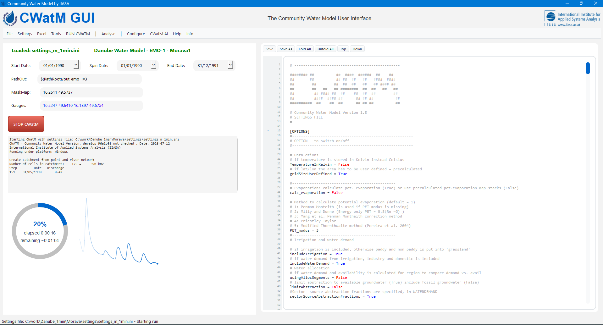
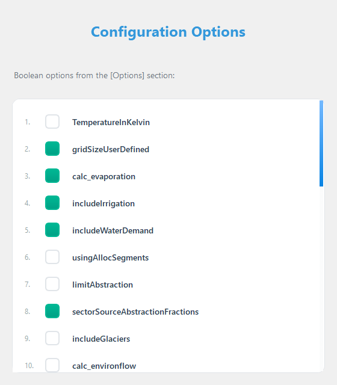
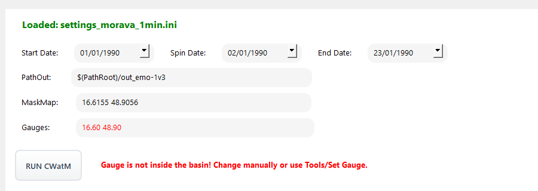
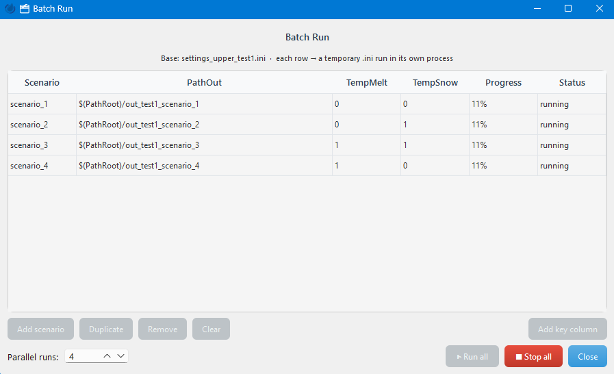
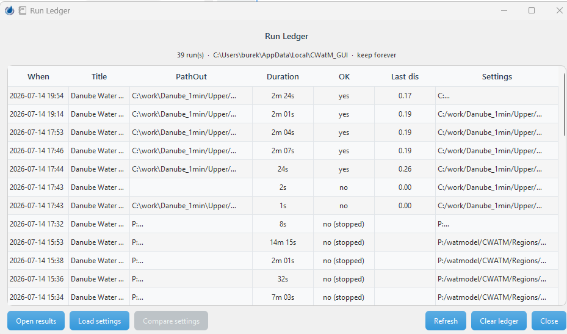
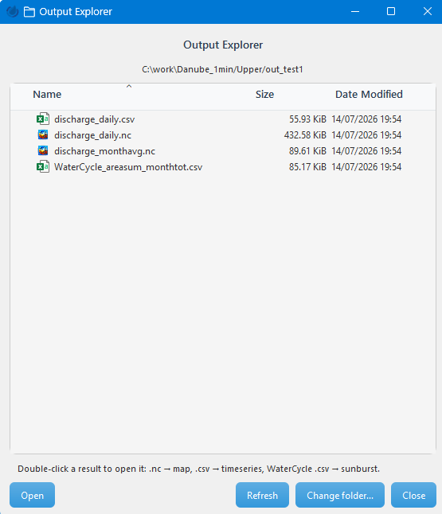

# CWatM GUI — Documentation and User Manual

A graphical user interface for the **Community Water Model (CWatM)** developed by
IIASA. The application lets you load, edit, validate and run CWatM settings files,
inspect the model set-up on a map, edit the reservoir/crop Excel workbook, and
visualise the model results — all without leaving the GUI.

> The screenshots in this manual were produced with the example set-up
> `Danube_1min/Morava` (`settings_m_1min.ini`) and its output folder `out_emo-1v3`.

---

## Table of Contents

1. [Introduction](#1-introduction)
2. [Installation and Requirements](#2-installation-and-requirements)
3. [Getting Started](#3-getting-started)
4. [User Interface Overview](#4-user-interface-overview)
5. [Menus and Keyboard Shortcuts](#5-menus-and-keyboard-shortcuts)
6. [Editing Settings](#6-editing-settings)
7. [Gauges, Mask and PathOut Checks](#7-gauges-mask-and-pathout-checks)
8. [Check settingsfile](#8-check-settingsfile)
9. [Running the Model](#9-running-the-model)
10. [Show Basin](#10-show-basin)
11. [Check Data](#11-check-data)
12. [Excel Editor (Crops / Reservoirs)](#12-excel-editor-crops--reservoirs)
13. [Result Analysis](#13-result-analysis)
13a. [CWatM AI](#13a-cwatm-ai)
14. [Configuration and Appearance](#14-configuration-and-appearance)
15. [Building the Executable](#15-building-the-executable)
16. [Troubleshooting](#16-troubleshooting)

---

## 1. Introduction

CWatM is a large-scale hydrological model. Its behaviour is driven by a plain-text
**settings file** (`.ini`) that points at input maps/meteo, defines the simulation
period, and switches processes on/off. This GUI wraps the whole workflow:

- a **syntax-highlighted editor** for the settings file with folding, bookmarks,
  change tracking and duplicate-key detection;
- convenience fields for the **dates, PathOut, MaskMap and Gauges** that write back
  into the settings automatically;
- **validation** tools (gauge-in-mask, PathOut existence, missing-file checks,
  Check Data);
- a one-click **Run** that streams the model output live with a progress clock;
- an **Excel editor** for the reservoir/crop workbook;
- **map and plot** windows to inspect the basin and the results.

---

## 2. Installation and Requirements

**Requirements**: Python 3.10+ (3.12 recommended), PySide6 (incl. QtWebEngine), NumPy,
pandas, xarray, rasterio, netCDF4, folium, plotly, openpyxl, requests, and the CWatM
model package. The optional **CWatM AI** chat needs `notebooklm-py`; the optional
**MODFLOW** coupling needs `flopy` + `xmipy` (and the MODFLOW 6 `libmf6` library). All
pinned versions are in `requirements.txt`.

```bash
pip install -r requirements.txt          # runtime (pinned)
pip install -r requirements.txt -r requirements_build.txt   # + PyInstaller, to build the exe
python cwatm_gui.py                       # run from source
```

Do **not** install a separate GDAL wheel — rasterio ships its own GDAL.

A pre-built **`CWatM_GUI.exe`** (one-folder build) can be run directly with no Python
installation. See [Building the Executable](#15-building-the-executable).

---

## 3. Getting Started

1. Start the application (`python cwatm_gui.py` or `CWatM_GUI.exe`). The window opens
   **maximised**.
2. **File ▸ Load .ini** (Ctrl+O) and pick a settings file — or drag a `.ini`/`.txt`
   file onto the window, or start `CWatM_GUI.exe <settings.ini>`.
3. The settings appear in the editor on the right; the date / PathOut / MaskMap /
   Gauges fields on the left are filled in from the file.
4. Edit as needed, then **RUN CWATM ▸ Run CWATM** (Ctrl+R).



---

## 4. User Interface Overview

- **Banner** (top): the CWatM icon, the title *“The Community Water Model User
  Interface”*, and the IIASA logo.
- **Menu bar** (directly below the banner): the whole application is menu-driven — see
  [Menus](#5-menus-and-keyboard-shortcuts).
- **Left panel**: the Start/Spin/End dates, PathOut, MaskMap and Gauges fields, the
  **RUN CWATM** button with a live *changed-fields* hint and warning label, and the
  circular **progress clock**.
- **Right panel**: the **settings editor** (plain-text with syntax highlighting, a
  line-number gutter with fold markers, and bookmarks).
- **Output box** (below): a read-only, copyable log of the model run, with the
  progress clock beneath it.

---

## 5. Menus and Keyboard Shortcuts

Menu bar (left → right): **File · Settings · Excel · Tools · RUN CWATM ·
Configure │ Analyse │ CWatM AI · Help · Info**. Recently opened files are listed
directly in the **File** menu (there is no separate History menu), and **CWatM AI**
is a clickable button, not a dropdown.

| Menu | Item | Shortcut | Action |
|------|------|----------|--------|
| File | Load .ini | Ctrl+O | Load a settings file |
| File | Reload | Ctrl+L | Reload the current file from disk |
| File | Save .ini | Ctrl+S | Save to the current file |
| File | Save As | Ctrl+Alt+S | Save to a new file |
| File | (recent files) | — | Up to **6** recently opened settings files, listed directly in the File menu between Save As and Exit |
| File | Exit | — | Quit (prompts if there are unsaved changes) |
| Settings | Fold All / Unfold All | Alt+0 / Alt+Shift+0 | Collapse / expand all sections |
| Settings | Top / Down | Alt+T / Alt+D | Jump to start / end of the file |
| Settings | Find / Find next / Replace | F5 / Ctrl+F / Ctrl+H | Search & replace in the editor |
| Settings | Undo / Redo | Ctrl+Z / Ctrl+Y | Undo/redo editor **and** field changes |
| Settings | Toggle / Next / Previous / Clear Bookmark | Ctrl+F2 / F2 / Shift+F2 / Ctrl+Shift+F2 | Bookmarks (orange gutter dots) |
| Settings | Goto last change | F3 | Jump to the most recently changed line |
| Settings | **Check settingsfile** | **F4** | Flag settings lines whose file/path is missing |
| Settings | **Clear checking** | **Shift+F4** | Remove the Check-settingsfile marks/bookmarks |
| Settings | Compare settings | — | Side-by-side diff of two settings files (differing lines in orange, synced scrolling, Next/Previous Diff) |
| Excel | **Crops** | — | Open the *Crops* sheet of the settings Excel workbook |
| Excel | **Reservoirs** | — | Open the *Reservoirs* sheet (with a **Release** button for *Reservoirs_downstream*) |
| Tools | Change Options | — | Boolean options window |
| Tools | Show Basin | — | Basin viewer on an OSM map |
| Tools | Set Gauge | — | Set Gauges to the largest-upstream point in the mask |
| Tools | Add output Watercycle | — | Add the WaterCycle output block |
| Tools | Check Data | — | Validate the settings by running CWatM's data checks |
| Tools | Create PathOut Folder | — | Create the resolved PathOut directory |
| Tools | Restore settingsfile | — | Open a CWatM output `dis*.nc` and re-create its settings file / list its input files |
| Tools | **Run Ledger** | — | Table of past runs; reopen results, reload settings, or Compare settings of two runs — see [§9](#9-running-the-model) |
| RUN CWATM | Run CWATM | Ctrl+R | Run / stop the model |
| RUN CWATM | Hidden Run CWatM | — | Open a separate window that runs CWatM in its own process (several can run in parallel) — see [§9](#9-running-the-model) |
| RUN CWATM | **Batch Run…** | — | Run many scenarios from the loaded file (base .ini + per-row overrides, N in parallel) — see [§9](#9-running-the-model) |
| Configure | Set / Write output box | — | The run-log file |
| Configure | Load previous settings at start | — | When ticked, the last settings file is re-opened automatically on the next startup |
| Configure | **Use Modflow** | — | Pre-load flopy for MODFLOW coupling (off = faster start) |
| Configure | Default openstreet map | — | Default basemap for Show Basin / NetCDF |
| Configure | Mode | — | Colour theme: Normal / Dark / Mikhail |
| Configure | Show Decimals | — | Decimals shown in all numeric read-outs |
| Configure | **Transparency** | — | Initial map transparency for Show Basin / NetCDF |
| Configure | **Select animal** | — | The cameo animal on the live discharge sparkline |
| Configure | **Run history folder… / retention…** | — | Where the Run Ledger is stored and how long runs are kept |
| Analyse | Open PathOut Folder | — | Open the resolved PathOut directory |
| Analyse | **Output Explorer** | — | Browse PathOut; double-click a result to open the right viewer |
| Analyse | Timeseries | — | Plot a result `.csv` (+ Load observed / metrics, range slider) |
| Analyse | NetCDF | — | Show a result `.nc` on a map (+ Fast/Total timeserie, Compare A−B) |
| Analyse | Watercycle | — | Water-balance sunburst |
| Analyse | Flow Diagram | — | Water-balance Sankey |
| CWatM AI | (button) | — | Chat about CWatM, answered by Google NotebookLM — see [§13a](#13a-cwatm-ai) |
| Help | Documentation / Features / **FAQ** | — | This manual / the feature tour / common questions & troubleshooting |
| Info | About CWatM | — | About dialog |

While CWatM is running the GUI stays fully usable (you can analyse results, browse the
ledger, chat with CWatM AI, …) — only **Save** is disabled, because the run uses the
file on disk. **Save As** still works.

---

## 6. Editing Settings

The editor **is** the settings file at all times — what you save is exactly what you
see. Highlights:

- **Syntax highlighting**: section headers bold, comments grey, `True`/`False` in
  blue/red. Hovering a CWatM variable name shows its unit / description.
- **Folding**: double-click a `[SECTION]` header (or the ▾/▸ gutter marker) to
  collapse it; folded sections are still saved and searched.
- **Bookmarks**: mark lines (Ctrl+F2 or click a line number) and jump with F2 /
  Shift+F2. Configure ▸ *Bookmark Change* can auto-bookmark changed lines.
- **Change tracking**: lines that differ from the last save get a **light-blue**
  background; **Goto last change** (F3) jumps to the most recent edit.
- **Duplicate keys** are drawn in a **strong red** — CWatM flattens all sections into
  one dictionary, so a repeated key silently overrides the earlier value. (This is a
  deeper red than the light-red used by Check settingsfile for a missing file.)
- **Left-window fields** (dates, PathOut, MaskMap, Gauges) auto-apply into the
  settings after a short debounce (without saving to disk); a blue hint right of RUN
  CWATM lists which fields differ from the file. Undo/Redo cover these too.
- **Change Options** (Tools) lists the boolean `[OPTIONS]` flags as tick boxes.



---

## 7. Gauges, Mask and PathOut Checks

The GUI continuously validates the **live** field values (not just the saved file):

- **Gauge-in-mask**: the Gauges field text is **blue** when every gauge lies inside
  the basin, **red** if any is outside. It works for a file-based MaskMap *and* a
  coordinate-based one (the basin is generated on the fly).
- A **warning label** right of RUN CWATM shows problems in red, e.g. *“Gauge is not
  inside the basin!”* or *“PathOut does not exist!”*.
- **Tools ▸ Set Gauge** places the gauge on the largest-upstream cell in the mask.
- **Tools ▸ Create PathOut Folder** creates the resolved output directory.



---

## 8. Check settingsfile

**Settings ▸ Check settingsfile** (F4) scans the settings as shown in the editor and
checks every value that can be identified as a **filename or path** (a `$(…)`
placeholder, a data-file extension such as `.nc/.tif/.map/.txt/.csv/.xlsx`, or an
absolute path). Placeholders are resolved from the other settings entries.

- Values whose file/folder **does not exist** get their line **marked red** and
  **bookmarked** — press **F2 / Shift+F2** to jump between them.
- Keys whose name starts with **`path`** (`PathRoot`, `PathOut`, `PathMaps`, …) are
  treated as **directories** and checked strictly for existence.
- **Semantic checks** run too: the simulation **date ordering**
  `StepStart ≤ SpinUp ≤ StepEnd`; **option dependencies** — an option switched **on** whose
  required keys are missing **or point to a non-existent path** (e.g.
  `modflow_coupling = True` with a bad `path_mf6dll`) — the **option line itself** is
  marked, not just the path line;
  and whether the run window fits inside the **meteo forcing** data's time range (reading
  the precipitation/temperature NetCDFs' time axis) — catching the common *"StepEnd is
  past my forcing data"* crash **before** you waste a run. Offending lines are marked and
  listed too.
- A concise summary — **only the problem lines** — is written to the output box.
- **Settings ▸ Clear checking** (Shift+F4) removes the red marks and the bookmarks
  the check added (your own bookmarks are kept).

---

## 9. Running the Model

**RUN CWATM ▸ Run CWATM** (Ctrl+R) starts the model; the same item becomes **Stop**
while it runs.

- Output streams **live** into the output box (per-timestep date + discharge
  overwrite a single line, as on the console); errors show in dark red.
- The **progress clock** shows the percentage plus **elapsed** and estimated
  **remaining** time, frozen as *run time* / *failed after* / *stopped after* at the
  end.
- **Run mode**: the model runs in its **own OS process** — Stop is an immediate kill
  (works even if the model hangs in C code) and a model crash cannot take the GUI down.
- **Live discharge sparkline**: next to the progress clock, a small plot of the
  discharge at the first gauge over the last ~3 months (older values fade out). Every
  so often a little animal (Configure ▸ **Select animal**) swims along the trace.
- **Output-box log file** (Configure): the run log can be appended to a file
  (`<PathOut>/cwatm_out.txt` by default, or a custom path).

Every finished run — main, Hidden or Batch — is recorded in the **Run Ledger** (below).

### Hidden Run CWatM

**RUN CWATM ▸ Hidden Run CWatM** opens a small **separate window** that runs CWatM on
a settings file in its **own process**, independent of the main window — so the main
GUI stays fully usable and **several Hidden Run windows can run at once** (e.g. to run
different settings files in parallel).

Each window opens **pre-loaded** with the settings file currently open in the main
window (shown in **bold green**); a **Load** button picks a different `.ini`. Press
**Run CWatM** (it toggles to **Stop CWatM** while running) and the run streams into
that window's own output box.

### Batch Run

**RUN CWATM ▸ Batch Run…** runs **many scenarios** derived from the loaded settings
file. A **table** where each row is a scenario:

- a **Scenario** name and its own **PathOut** (defaulted to `<base PathOut>_<name>` so
  runs don't collide; the folder is created automatically);
- per-scenario **key = value overrides** — add a column with **Add key column**, which
  takes the key from the settings-editor's **cursor line** (put the cursor on the key
  you want to vary, e.g. `SnowMeltCoef`, then press the button).

Set **Parallel runs** (1 = sequential) and press **▶ Run all**; each row shows a live
**Progress / Status**. **Stop all** kills everything; **Clear** starts fresh. The
scenario table is **remembered** between sessions. Each finished scenario is written to
the Run Ledger.

For a **parameter sweep** (sensitivity analysis / manual calibration), press **Sweep…**
and enter one `key: values` line per parameter — the values as a **list**
(`SnowMeltCoef: 3.5, 4.0, 4.5`) or a **range** `min:max:step` (`3.5:4.5:0.5`). Several
keys generate the **full grid** of combinations; the rows (with their own PathOut per
combination) are filled in for you.



### Run Ledger

**Tools ▸ Run Ledger** is a table of your **past runs** (main, Hidden and Batch) — time,
Title, PathOut, duration, success and last discharge. Select a run and:

- **Open results** — its PathOut in the Output Explorer;
- **Load settings** — reopen its settings file in the main window;
- **Compare settings** — mark **two** runs (Ctrl/Shift+click) and diff the settings each
  one actually used (a snapshot is kept per run, so the diff is correct even if you edit
  the file later).

Where the ledger is stored and how long runs are kept are set in **Configure ▸ Run
history folder… / retention…** (default: keep 60 days under
`%LOCALAPPDATA%\CWatM_GUI`).



---

## 10. Show Basin

**Tools ▸ Show Basin** opens the basin viewer — a Leaflet (**EPSG:4326**) map with the
`ups.nc` upstream-area river network and the catchment **mask** overlaid on an OSM
basemap, drawn in native lon/lat (no reprojection blur).


- **Markers**: red pins = the gauges (numbered `1..N`, taken from the Gauges box),
  a blue **M** = the mask-start, black = the last clicked cell.
- **Click** anywhere to read the coordinates, basin area and mask state in the strip
  under the map.
- **Buttons**: Hide/Show Mask, Create new Mask, **Copy Mask**, Zoom to Mask, Create
  gauge / **Copy Gauge** (accumulate several gauges, then commit them all to the
  Gauges box), **Load JSON** (overlay a GeoJSON), Exit. **Clicking a gauge pin removes
  it** from the working list.
- **OSM transparency slider**: fades between only-the-data (0 %) and the OSM basemap
  with the data at 50 % on top (100 %); the start value comes from Configure ▸
  Transparency. A **Basemap** dropdown switches the OSM style.

---

## 11. Check Data

**Tools ▸ Check Data** runs CWatM's own data checks against the settings (input maps,
resolutions, extents) and lists any trouble in a table. It works only with a
**file-based MaskMap** (not coordinates). It can also compare against an existing
discharge NetCDF and restore settings from a discharge map.


---

## 12. Excel Editor (Crops / Reservoirs)

The **Excel** menu opens sheets of the workbook named in the settings
`Excel_settings_file` in an editable table that **reproduces the sheet's cell
colours** (fill and font).

- **Excel ▸ Crops** — the crop parameter table.

  

- **Excel ▸ Reservoirs** — the reservoir table, with an extra **Release** button
  (right of Save As) that opens the **Reservoirs_downstream** companion sheet; the
  button is greyed out if that sheet is absent.

  

- Cells are **editable**; **Reload / Save / Save As** write the edits back through the
  workbook, **preserving every other sheet and all styling**. Very large sheets load
  instantly (the table is lazy — only the visible cells are read).

---

## 13. Result Analysis

The **Analyse** menu visualises CWatM results. Each window has a **Save HTML** button
that exports the current, self-contained plot.

### 13.0 Output Explorer

**Analyse ▸ Output Explorer** is a browser of the resolved **PathOut** folder:
**double-click** a result and it opens in the matching viewer — `.nc` → NetCDF map,
`WaterCycle*.csv` → sunburst, other `.csv` → Timeseries. It turns "run → analyse" into
one click instead of a file dialog.



### 13.1 Timeseries

**Analyse ▸ Timeseries** plots a result `.csv` (e.g. `discharge_daily.csv`) as a line
chart. Multiple columns are shown one at a time (Forward/Backward); **Compare**
overlays another result file; **Save as csv** exports the shown series in the CWatM
result-CSV format.

- A **range slider** below the plot shrinks the displayed period from either end.
- **Load observed** overlays an observed series (a CWatM `.csv` or a simple
  `date,value.csv`) and shows goodness-of-fit metrics — **KGE / NSE / PBIAS / RMSE** —
  computed over the period the slider selects. This is the model-evaluation step you no
  longer need Excel/Python for.


### 13.2 NetCDF

**Analyse ▸ NetCDF** shows a result `.nc` (e.g. `discharge_daily.nc`) as a raster
overlay on an OSM map (EPSG:4326). A **timestep slider + Play** scrubs through time; a
**colour-scale** selector, **Log scale** toggle and **OSM transparency** slider tune
the display. Click a cell to read its value. The left-window gauges appear as small
numbered red pins.

- Plot a clicked cell's series with **Fast Display Timeserie** (quick — the map's
  timesteps only, with gaps) or **Total Timeseries** (every timestep — can take a while,
  so a progress bar shows next to the buttons).
- **Compare A−B** loads a second `.nc` on the same grid and shows the **difference**
  (this − other) per timestep on a red/blue diverging scale — ideal for comparing two
  scenarios you just ran. **Clear compare** returns to the single-file view.


### 13.3 Watercycle

**Analyse ▸ Watercycle** reads a `WaterCycle_areasum_monthtot.csv` and shows the
overall water balance as a **sunburst** (Inputs / Outputs / Storage /
Evapotranspiration / Transpiration). A month **range slider** selects the period.


### 13.4 Flow Diagram

**Analyse ▸ Flow Diagram** shows the same water balance as a **Sankey** flow diagram
(Precipitation → Rain/Snow → Soil/Groundwater/Runoff → Waterbodies → Discharge, plus
withdrawal/consumption), over the slider-selected months.


---

## 13a. CWatM AI

The **CWatM AI** button (left of *Help*) opens a chat window where questions about
CWatM are answered by Google **NotebookLM** (Gemini), grounded on the CWatM
documentation. Type a question and press **Enter** (Shift+Enter for a new line);
answers are shown as formatted text, and the transcript and question history are kept
between sessions. A **Short / Medium / Long** selector sets the answer length.

To use it you sign in **once** with your Google account (**Login…**):

- **From Firefox** — the easiest, no administrator rights needed.
- **From Chrome / Edge / Opera** — Windows encrypts these browsers' cookies, so you
  must **run CWatM as administrator** first, then choose the browser.
- **Google login window** — an interactive sign-in; only available when running from
  source (it needs the optional `playwright` package).

After a successful login the session is reused automatically on later runs. A full,
dedicated guide is in **`documentation/CWatM_AI_NotebookLM.md`**.

Two buttons bridge the chat and the editor: **→ Settings** inserts a `key = value`
from an answer into the settings file under the right section, and **Explain current
line** asks NotebookLM to explain the editor's current settings line.

---

## 14. Configuration and Appearance

Under the **Configure** menu:

- **Mode** — colour theme of the whole GUI: **Normal** (light), **Dark**, **Mikhail**
  (black + amber). Switches live and is remembered.
- **Show Decimals** — how many decimals every numeric read-out shows (default 3).
- **Transparency** — the initial map transparency (0–100) that Show Basin and NetCDF
  open with.
- **Select animal** — the little animal (Fish / Otter / Beaver / Sailboat) that
  occasionally appears on the live discharge sparkline during a run.
- **Default openstreet map** — the default basemap for the map windows.
- **Load previous settings at start** — when ticked, the last settings file you had
  open is re-opened automatically the next time the GUI starts.
- **Use Modflow** — when on, the GUI pre-loads the MODFLOW coupling library (flopy) so
  MODFLOW-coupled runs/checks are ready; when off (default) flopy is not loaded, keeping
  startup fast. *(A MODFLOW run also needs `xmipy` and the MODFLOW 6 library `libmf6`
  whose path you set in the settings — the GUI does not ship the DLL.)*
- **Run history folder… / retention…** — where the **Run Ledger** is stored and how
  many days of runs to keep (0 = keep forever).
- **Bookmark Change** — auto-bookmark a line when it is edited.
- **Set / Write output box** — the run-log file.

All Configure settings are persisted across sessions.

---

## 15. Building the Executable

The one-folder build is produced with PyInstaller from `cwatm_gui_dir.spec`:

```bash
pip install -r requirements.txt -r requirements_build.txt
python -m PyInstaller cwatm_gui_dir.spec --noconfirm
```

The result is `dist/CWatM_GUI/CWatM_GUI.exe` (plus an `_internal/` folder that also
contains the lightweight `CWatM_model.exe` child process used for model runs). The
spec collects rasterio + GDAL data, xarray backends, folium/plotly, **openpyxl**,
requests, QtWebEngine, the **MODFLOW** stack (flopy + matplotlib + xmipy), the CWatM AI
libraries, the `cwatm`/`src` code and the documentation (incl. these screenshots).
Reference notes: `cwtmexe.md`, `makeitfaster.md`.

---

## 16. Troubleshooting

- **A map or plot is blank** — the map/plot windows need QtWebEngine; behind a
  corporate proxy the tiles are fetched with Python (proxy-proof). If the OSM basemap
  is missing, only the tiles failed — the data overlay and controls still work.
- **“Gauge is not inside the basin!”** — move the gauge (Tools ▸ Set Gauge or the
  basin viewer's Create/Copy Gauge), or fix the MaskMap.
- **“PathOut does not exist!”** — Tools ▸ Create PathOut Folder.
- **Check settingsfile flags a line red** — the resolved file/folder was not found;
  the output box lists the resolved path. `Path…` keys are checked as directories. (A
  **strong-red** line in the editor instead means a *duplicate key*, not a missing file.)
- **The run stops early with a date/time error** — the run window is likely past your
  forcing data; run **Check settingsfile** (F4), which now warns when `StepEnd` is after
  the meteo forcing ends.
- **A MODFLOW run fails** — it needs `xmipy` + `flopy` installed and the `libmf6`
  library path set in the settings; enable **Configure ▸ Use Modflow** for a faster
  first use.
- **Diagnostic log** — swallowed errors are written to
  `%LOCALAPPDATA%/CWatM_GUI/gui.log`.

**More answers:** a fuller FAQ is in-app under **Help ▸ FAQ**
(`documentation/CWatM_GUI_FAQ.md`).

---

*This manual is also available in-app under **Help ▸ CWatM GUI Documentation**; the
shorter feature tour is under **Help ▸ CWatM GUI Features**, and common questions under
**Help ▸ FAQ**.*
