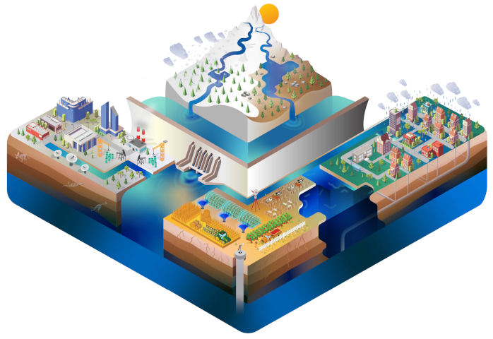

# CWatM GUI — Documentation and User Manual

**Community Water Model (CWatM) by IIASA**

<p align="center">
  
  &nbsp;&nbsp;&nbsp;&nbsp;&nbsp;
  
</p>

<p align="center">
  
</p>

---

## Table of Contents

1. [Introduction](#1-introduction)
2. [Installation and Requirements](#2-installation-and-requirements)
3. [Getting Started](#3-getting-started)
4. [User Interface Overview](#4-user-interface-overview)
5. [Menus and Keyboard Shortcuts](#5-menus-and-keyboard-shortcuts)
6. [Step-by-Step User Manual](#6-step-by-step-user-manual)
7. [Gauges, Mask and PathOut Checks](#7-gauges-mask-and-pathout-checks)
8. [Output Logging](#8-output-logging)
9. [Data Visualization and Validation](#9-data-visualization-and-validation)
10. [Technical Documentation](#10-technical-documentation)
11. [Building the Executable](#11-building-the-executable)
12. [Troubleshooting](#12-troubleshooting)
13. [Frequently Asked Questions](#13-frequently-asked-questions)
14. [Contact and Support](#14-contact-and-support)

---

## 1. Introduction

The CWatM GUI (Graphical User Interface) is a desktop application for the Community
Water Model (CWatM) developed by the International Institute for Applied Systems
Analysis (IIASA). It lets you load, parse, edit and manage CWatM settings (`.ini`)
files and run the model directly from the interface, without using the command line.

**Key benefits**

- A **menu-driven** interface that removes command-line complexity.
- Live settings-file editing with syntax highlighting and collapsible sections.
- Integrated model execution with a progress clock and real-time output.
- Built-in checks: gauges-in-basin, PathOut existence, and helper tools.
- Data-visualisation tools for the basin/mask and data validation (Check Data).

**Target audience:** researchers, hydrologists, water-resource managers and students
working with the CWatM hydrological model.

> **What changed in this version.** The GUI is now menu-driven. The former on-screen
> buttons (Load Text, Actualize, Options, Show Basin, Check Data, and the "Write
> output" checkbox) have moved into menus. Field changes now auto-apply to the
> settings content in memory (see §6.3), and several new tools were added (Set Gauge,
> Add output Watercycle, Create PathOut Folder).

---

## 2. Installation and Requirements

**Requirements**

- Python 3.8+
- PySide6 (Qt for Python)
- NumPy, pandas, SciPy
- xarray and netCDF4 (NetCDF data)
- rasterio (raster / mask data)

**Run from source**

```bash
pip install PySide6 numpy pandas scipy xarray netCDF4 rasterio
python cwatm_gui.py
```

**Windows executable**

A packaged Windows executable can be produced with PyInstaller (see
[§11](#11-building-the-executable)). The app starts maximized on larger screens and
shows the CWatM icon in the taskbar.

---

## 3. Getting Started

**Quick start**

1. **Launch** — run `python cwatm_gui.py` (or the built executable). The window opens
   with a banner and a menu bar on top, a left control panel and a right editor panel.
2. **Load a settings file** — **File ▸ Load .ini** (Ctrl+O), pick a `.ini` file. It
   parses automatically with syntax highlighting and collapsible sections.
3. **Adjust settings (optional)** — edit Start/Spin/End Date, PathOut, MaskMap or
   Gauges. Changes auto-apply to the content in memory; **Save / Save As** turn blue
   to show there are unsaved changes.
4. **Save** — **File ▸ Save .ini** (Ctrl+S) writes the changes to disk.
5. **Run** — **RUN CWATM ▸ Run CWATM** (Ctrl+R). Watch the progress clock and the
   real-time output box. Selecting Run CWATM again stops a running model.

---

## 4. User Interface Overview


*The main window: the banner and menu bar on top; the control panel (dates, PathOut,
MaskMap, Gauges, the RUN CWatM button, the output box and the progress clock) on the
left; and the syntax-highlighted settings editor on the right.*

Schematically:

```
┌───────────────────────────────────────────────────────────────────────────┐
│ [icon] CWatM GUI    The Community Water Model User Interface     [IIASA]     │  banner
├───────────────────────────────────────────────────────────────────────────┤
│ File   Settings   Tools   RUN CWATM   Configure                     Info    │  menu bar
├─────────────────────────────────────┬─────────────────────────────────────┤
│ Left control panel                  │ Right editor panel                    │
│  • "Loaded: <file>" label           │  • Save / Save As                     │
│  • Start / Spin / End Date          │  • Fold All / Unfold All              │
│  • PathOut                          │  • Top / Down                         │
│  • MaskMap                          │  • Syntax-highlighted settings text   │
│  • Gauges                           │    with [-]/[+] collapsible sections  │
│  • RUN CWatM + warning label        │                                       │
│  • Output box (left-aligned)        │                                       │
│  • Progress clock (below the box)   │                                       │
└─────────────────────────────────────┴─────────────────────────────────────┘
```

**Left control panel**

- **"Loaded:" label** — the currently loaded file name (larger font, left-aligned).
- **Date fields** — Start Date (StepStart), Spin Date (SpinUp), End Date (StepEnd),
  with chronological validation.
- **PathOut** — output directory (placeholders like `$(PathRoot)` are supported).
- **MaskMap** — mask file path or a coordinate pair defining the model domain.
- **Gauges** — gauge coordinates, linked to the settings `Gauges` entry. The text is
  coloured blue/red depending on whether the gauges are inside the basin (see §7).
- **RUN CWatM button** with a **red warning label** to its right for problems.
- **Output box** — real-time model output; left-aligned, text selectable/copyable.
- **Progress clock** — circular progress indicator, shown **below** the output box.

**Right editor panel**

- Toolbar: **Save**, **Save As** (turn blue when there are unsaved changes),
  **Fold All**, **Unfold All**, **Top**, **Down**.
- Syntax-highlighted settings text: comments in grey, `True` in blue, `False` in red,
  bold section headers with `[-]`/`[+]` collapse controls.

---

## 5. Menus and Keyboard Shortcuts

| Menu | Item | Shortcut | Action |
|------|------|----------|--------|
| **File** | Load .ini | Ctrl+O | Open a settings file (auto-parses) |
| | Reload | Ctrl+L | Reload the current file from disk (asks if there are unsaved changes) |
| | Save .ini | Ctrl+S | Save to the current file |
| | Save As | Ctrl+Alt+S | Save to a new file |
| | Exit | — | Quit (prompts Save/Discard/Cancel if unsaved) |
| **Settings** | Fold All | Alt+0 | Collapse all sections |
| | Unfold All | Alt+Shift+0 | Expand all sections |
| | Top | Alt+T | Jump to the start of the file |
| | Down | Alt+D | Jump to the end of the file |
| | Find | F5 | Prompt for text and find it in the editor |
| | Find next | Ctrl+F | Repeat the last Find (wraps around) |
| | Undo | Ctrl+Z | Undo editor change |
| | Redo | Ctrl+Y | Redo editor change |
| **Tools** | Change Options | — | Open the Options window ([OPTIONS] booleans) |
| | Show Basin | — | Open the basin viewer |
| | Set Gauge | — | Set Gauges to the largest-upstream point inside the mask |
| | Add output Watercycle | — | Insert `OUT_TSS_AreaSum_Daily = WaterCycle` under `[OUTPUT]` |
| | Check Data | — | Open the Check Data validation window |
| | Create PathOut Folder | — | Create the resolved PathOut directory if missing |
| **RUN CWATM** | Run CWATM | Ctrl+R | Run / stop the model |
| **Configure** | Set output box file | — | Choose a custom output-log file (kept in memory) |
| | Write output box | — | Checkable; write the run log (tooltip shows the path) |
| **Info** | About CWatM | — | About dialog |

Tooltips: hover over **Change Options** ("Display a popup with the settingsfile
[Options]"), **Set Gauge** ("Find the point with the largest upstream area in Mask
Map"), **Add output Watercycle** ("Adds an additional output for creating
watercycles"), and **Write output box** (shows the current output-file path).

### Buttons vs. menu items

Some actions exist **both** as a visible button *and* as a menu item; others were moved
entirely into menus (their buttons are hidden):

| Action | Visible button? | Menu item |
|--------|-----------------|-----------|
| Run / Stop CWatM | Yes (RUN CWatM button) | RUN CWATM ▸ Run CWATM |
| Save / Save As | Yes (editor toolbar) | File ▸ Save .ini / Save As |
| Fold All / Unfold All | Yes (editor toolbar) | Settings ▸ Fold All / Unfold All |
| Top / Down | Yes (editor toolbar) | Settings ▸ Top / Down |
| Load file | **No** (button removed) | File ▸ Load .ini |
| Change Options | **No** (button removed) | Tools ▸ Change Options |
| Show Basin | **No** (button removed) | Tools ▸ Show Basin |
| Check Data | **No** (button removed) | Tools ▸ Check Data |
| Write output log | **No** (checkbox removed) | Configure ▸ Write output box |
| Actualize | **No** (removed entirely) | — (field changes auto-apply) |

---

## 6. Step-by-Step User Manual

### 6.1 Loading and parsing settings files

1. **File ▸ Load .ini** (Ctrl+O) and choose a `.ini` file.
2. The file parses automatically: syntax highlighting, collapsible sections, and the
   Date / PathOut / MaskMap / Gauges fields are populated from the content.
3. Use **File ▸ Reload** (Ctrl+L) to re-read the file from disk (it asks before
   discarding unsaved changes).

### 6.2 Dates and validation

- **Start Date (StepStart)**, **Spin Date (SpinUp)**, **End Date (StepEnd)**.
- The GUI enforces chronological order (start ≤ spin ≤ end).
- **Integer SpinUp / StepEnd**: if either is given as an integer *N* (a timestep count)
  instead of a date, the field is shown as `StepStart + (N − 1)` days, matching CWatM's
  convention where StepStart is timestep 1.

### 6.3 Editing fields — auto-apply (no save)

Changing **Start/Spin/End Date, PathOut, MaskMap or Gauges** automatically updates the
settings content in memory and refreshes the editor a moment after you stop typing
(~0.5 s debounce). **This does not write to disk** — Save / Save As turn blue to show
there are unsaved changes. Saving or running flushes any pending change first.

### 6.4 Managing options

**Tools ▸ Change Options** opens a window listing all boolean parameters from the
`[OPTIONS]` section as checkboxes. Toggling a checkbox updates the content immediately
and marks the document as changed.

### 6.5 Saving and section management

- **File ▸ Save .ini** (Ctrl+S) / **Save As** (Ctrl+Alt+S) write clean content
  (no `[-]`/`[+]` markers), preserving formatting and whitespace.
- **Settings ▸ Fold All / Unfold All** collapse/expand all sections; click a `[-]`/`[+]`
  marker to toggle a single section. **Top / Down** jump to the file start/end.
- **Undo / Redo** (Ctrl+Z / Ctrl+Y) and **Find / Find next** (F5 / Ctrl+F) operate on
  the editor text.

### 6.6 Running the model

1. Make sure the settings are correct and **saved** (Run executes the file **on disk**).
2. Optionally enable **Configure ▸ Write output box** to log the run to a file (§8).
3. **RUN CWATM ▸ Run CWATM** (Ctrl+R). The progress clock shows completion (0–100%)
   and output appears live in the output box.
4. Selecting **Run CWATM** again during a run stops it (graceful stop with cleanup of
   open NetCDF/file handles).

The model runs in a separate thread, so the GUI stays responsive. Errors appear in
dark red in the output box.

---

## 7. Gauges, Mask and PathOut Checks

### 7.1 Gauges field and the in-basin check

The **Gauges** field (under MaskMap) is linked to the settings `Gauges` entry. On load
and save, and whenever you edit the gauge coordinates, the GUI checks whether the gauge
points fall **inside the mask/basin**:

- **Blue** field text — all gauges are inside the basin.
- **Red** field text — at least one gauge is outside; a red message appears next to
  the RUN CWatM button:
  *"Gauge is not inside the basin! Change manually or use Tools/Set Gauge."*

The check works for **both** a file-based MaskMap (a raster) and a **coordinate-based**
MaskMap (a `lon lat` pair, for which a basin is generated internally). The generated
mask is cached in memory and only rebuilt when a file is loaded or the MaskMap changes
and is saved. If the mask cannot be built (e.g. a coordinate MaskMap with no resolvable
`ups.nc`), a short status-bar note is shown and the check is skipped.

### 7.2 Tools ▸ Set Gauge

Sets the Gauges field to the cell centre with the **largest upstream area** (from
`ups.nc`) that lies inside the mask, formatted to four decimal places. This is a quick
way to place a gauge on the main river outlet of the basin.

### 7.3 PathOut existence check

On load and save, the GUI resolves PathOut (expanding placeholders such as
`$(PathRoot)`) and checks that the folder exists. If it does not, a red message appears
next to RUN CWatM: *"PathOut does not exists! You can use Tools/Create PathOut Folder."*

### 7.4 Tools ▸ Create PathOut Folder

Creates the resolved PathOut directory (including missing parents) and clears the
warning.

### 7.5 Tools ▸ Add output Watercycle

Inserts the line `OUT_TSS_AreaSum_Daily = WaterCycle` under the `[OUTPUT]` section (or
creates `[OUTPUT]` if absent). It first checks that a WaterCycle entry for that key is
not already present, so it will not add a duplicate. The change is in memory only until
you Save.

---

## 8. Output Logging

Enable **Configure ▸ Write output box** to write the run output to a file.

- **Location** — by default `<PathOut>/cwatm_out.txt` (placeholders resolved). Use
  **Configure ▸ Set output box file** to choose a custom path/name, which is kept in
  memory for the session. The **Write output box** tooltip shows the current path.
- **Append, not overwrite** — each run is appended to the file. A header is written
  straight to the file (not shown in the output box):

  ```
  =================================
  2026-07-01 14:32:05
  ---------------------------------
  ```

  and a blank line is written after the run's content. Successive runs are therefore
  clearly delimited within one file.

The on-screen output box itself shows the run content only; the header/footer lines are
file-only. Per-timestep "date + discharge" progress overwrites a single line in the box
(mirroring the console). The output text is selectable and can be copied with Ctrl+C or
via right-click ▸ "Copy all output".

---

## 9. Data Visualization and Validation

### 9.1 Basin viewer (Tools ▸ Show Basin)

Displays basin/NetCDF data with native Qt rendering (no matplotlib dependency):

- Mouse-wheel and button zoom; click-and-drag pan with coordinate tracking.
- UPS data shown with a viridis-like colormap and a semi-transparent green mask overlay.
- Click a location to read its lon/lat and data values.
- Opens as a modal dialog tied to the main window.

### 9.2 Check Data (Tools ▸ Check Data)

Validates a configuration by running CWatM in check mode (`-c`) without a full run:

- Optional comparison against an existing discharge NetCDF file.
- Results saved to CSV and shown in an interactive, sortable table.
- Detects configuration issues, missing files and data inconsistencies.
- **Restore settings from discharge map** — reads the `version_settingsfile` global
  attribute from a discharge NetCDF and writes `settings_restore_dischargenc.ini`.

---

## 10. Technical Documentation

### 10.1 Architecture

| Module | Responsibility |
|--------|----------------|
| `cwatm_gui.py` | Entry point, application icon / taskbar identity, exception handling |
| `src/gui/components/main_window.py` | Main window; menus, fields, run control, checks |
| `src/gui/components/config_parser.py` | INI parsing, date/settings extraction, updates |
| `src/gui/managers/date_manager.py` | Date widgets, validation, integer SpinUp/StepEnd |
| `src/gui/managers/file_manager.py` | File load/save operations |
| `src/gui/managers/text_display.py` | Editor text area / content management |
| `src/gui/widgets/options_window.py` | `[OPTIONS]` boolean editor |
| `src/gui/widgets/check_data_window.py` | Check Data / NetCDF comparison |
| `src/gui/widgets/basin_viewer.py` | Basin viewer + mask/gauge/PathOut helper functions |
| `src/gui/utils/progress_clock.py` | Circular progress indicator |
| `src/gui/utils/cwatm_worker.py` | Threaded CWatM execution worker |

Key helper functions in `basin_viewer.py`: `build_mask_context`, `gauges_inside`,
`gauges_in_maskmap`, `pathout_exists`, `find_largest_ups_gauge`.

### 10.2 Threading

- CWatM runs in a `CWatMWorker` QThread; the GUI stays responsive.
- Communication via Qt signals (`finished`, `error`, `progress`).
- Cooperative stop with a timeout fallback; NetCDF datasets and file handles are closed
  on stop, error and shutdown.

### 10.3 Output capture

- A `PrintRedirector` captures stdout/stderr and emits Qt signals to the output box.
- Normal text in black, errors in dark red; internal "Worker:" lines are filtered.
- The output buffer keeps the last ~100 lines for the on-screen display; the log file
  (when enabled) keeps the full history.

### 10.4 File formats

- Settings: INI (`.ini`), UTF-8, original formatting preserved.
- Data: NetCDF4; rasters (GeoTIFF, etc.) via rasterio; CSV for Check Data output.

---

## 11. Building the Executable

The project uses a virtual environment named **`venv/`** (an older `build_env/` copy is
deprecated). Build with PyInstaller:

```powershell
venv\Scripts\Activate.ps1
python -m PyInstaller cwatm_gui_dir.spec --noconfirm
```

- `cwatm_gui_dir.spec` — one-folder build (recommended); `cwatm_gui.spec` — one-file.
- The specs collect rasterio and xarray submodules and data, copy xarray's metadata,
  bundle `cwatm` / `src` / `assets`, set `console=False`, and disable UPX for faster
  builds.

See the companion notes in this folder: **`cwtmexe.md`** (rasterio/xarray/GDAL
packaging fixes), **`makeitfaster.md`** (PyInstaller build speed), and
**`nuitka_plan.md`** (optional Nuitka build for faster runtime).

---

## 12. Troubleshooting

**Application fails to start**
1. Check Python 3.8+ (`python --version`).
2. `pip install PySide6 numpy pandas scipy xarray netCDF4 rasterio`.
3. Run from a terminal to see error messages.

**Settings file won't load**
1. Confirm it is a valid INI file with UTF-8 encoding.
2. Check file permissions and look for syntax errors.
3. Try a known-good settings file.

**Date validation errors**
1. Use a supported format (e.g. DD/MM/YYYY, YYYY-MM-DD) or an integer for SpinUp/StepEnd.
2. Keep chronological order (Start ≤ Spin ≤ End).

**Gauges shown red / "Gauge is not inside the basin!"**
1. Use **Tools ▸ Set Gauge** to place the gauge on the largest-upstream cell.
2. Or edit the coordinates manually; the field turns blue when inside.
3. If the check is skipped (status-bar note), verify the MaskMap and that `ups.nc` is
   resolvable.

**"PathOut does not exists!"**
1. Use **Tools ▸ Create PathOut Folder**, or fix the PathOut / `$(PathRoot)` value.

**CWatM execution fails**
1. Verify all referenced files exist and PathOut is writable.
2. **Save** before running — Run uses the file on disk.
3. Review the error messages (dark red) in the output box; enable the output log for a
   full record.

**GUI becomes unresponsive**
1. Wait for the current operation, or stop a running model (Ctrl+R).
2. Restart the application if necessary.

---

## 13. Frequently Asked Questions

**Q: Can I run several simulations at once?**
No — one run at a time, to avoid resource conflicts and keep output management clean.

**Q: Do field edits change the file on disk?**
No. Editing Date/PathOut/MaskMap/Gauges updates the content **in memory** only; use
Save / Save As to write to disk. Running the model uses the file on disk, so save first.

**Q: What happened to the Actualize button?**
It was removed. Field changes now auto-apply to the content automatically, and Save
writes them to disk. Save / Run flush any pending change first.

**Q: My manual edits — are they kept when I fold/unfold sections?**
Yes. Folding/unfolding is a view operation and preserves your edits.

**Q: Which mask formats are supported for the gauge check?**
A file-based MaskMap (raster via rasterio) or a coordinate-based MaskMap (a `lon lat`
pair, for which a basin is generated internally using `ups.nc`).

**Q: Does the output log overwrite previous runs?**
No — it appends, with a dated header separating each run.

**Q: Can I use the GUI on Linux or macOS?**
Yes, it is cross-platform. Install Python 3.8+ and the required packages and run from
source. (The Windows taskbar-icon tweak is a no-op elsewhere.)

---

## 14. Contact and Support

**International Institute for Applied Systems Analysis (IIASA)**
Email: info@iiasa.ac.at · Website: www.iiasa.ac.at

- **CWatM documentation & source:** https://github.com/iiasa/CWatM
- **Issues / feature requests:** use the GitHub repository; include error messages,
  system information, steps to reproduce, and a sample settings file (remove sensitive
  data).

**Citing the CWatM GUI**

> CWatM GUI Application, International Institute for Applied Systems Analysis (IIASA),
> Laxenburg, Austria. Available at: https://github.com/iiasa/CWatM

---

*Document version: 3.0 · Format: Markdown · Supersedes the RTF documentation (v2.0).*
