# CWatM GUI — Documentation and User Manual

## Version 1.05

A graphical user interface for the **Community Water Model (CWatM)** developed by
IIASA. The application lets you load, edit, validate and run CWatM settings files,
inspect the model set-up on a map, edit the reservoir/crop Excel workbook, and
visualise the model results — all without leaving the GUI.

> The screenshots in this manual were produced with the example set-up
> `Danube_1min/Morava` (`settings_morava_1min.ini`) and its output folder.

---

## Table of Contents

1. [Introduction](#1-introduction)
2. [Installation and Requirements](#2-installation-and-requirements)
3. [Getting Started](#3-getting-started)
4. [User Interface Overview](#4-user-interface-overview)
5. [Menus and Keyboard Shortcuts](#5-menus-and-keyboard-shortcuts)
6. [Editing Settings](#6-editing-settings)
7. [Gauges, Mask and PathOut Checks](#7-gauges-mask-and-pathout-checks)
8. [Check settingsfile](#8-check-settingsfile)
9. [Running the Model](#9-running-the-model)
10. [Show Basin](#10-show-basin)
11. [Check Data](#11-check-data)
12. [Excel Editor (Crops / Reservoirs)](#12-excel-editor-crops--reservoirs)
13. [Result Analysis](#13-result-analysis)
14. [CWatM AI (NotebookLM)](#14-cwatm-ai-notebooklm)
15. [Configuration and Appearance](#15-configuration-and-appearance)
16. [Building the Executable and Installer](#16-building-the-executable-and-installer)
17. [Troubleshooting](#17-troubleshooting)
18. [Versioning](#18-versioning)

---

## 1. Introduction

CWatM is a large-scale hydrological model. Its behaviour is driven by a plain-text
**settings file** (`.ini`) that points at input maps/meteo, defines the simulation
period, and switches processes on/off. This GUI wraps the whole workflow:

- a **syntax-highlighted editor** for the settings file with folding, bookmarks,
  change tracking and duplicate-key detection;
- convenience fields for the **dates, PathOut, MaskMap and Gauges** that write back
  into the settings automatically;
- **validation** tools (gauge-in-mask, PathOut existence, missing-file checks,
  Check Data);
- a one-click **Run** that streams the model output live with a progress clock;
- an **Excel editor** for the reservoir/crop workbook;
- **map and plot** windows to inspect the basin and the results;
- a **CWatM AI** chat that answers questions about CWatM from Google NotebookLM.

---

## 2. Installation and Requirements

**Requirements**: Python 3.10+ (3.12 recommended), PySide6 (incl. QtWebEngine), NumPy,
pandas, xarray, rasterio, netCDF4, folium, plotly, openpyxl, requests, and the CWatM
model package. The optional **CWatM AI** chat needs `notebooklm-py[cookies]` (+
`rookiepy`); the optional **MODFLOW** coupling needs `flopy` + `xmipy` (and the
MODFLOW 6 `libmf6` library). All pinned versions are in `requirements.txt`.

```bash
pip install -r requirements.txt          # runtime (pinned)
pip install -r requirements_build.txt    # + PyInstaller, only to build the exe
python cwatm_gui.py                       # run from source
```

Do **not** install a separate GDAL wheel — rasterio ships its own GDAL.

A pre-built **`CWatM_GUI.exe`** (one-folder build) or the per-user **installer**
(`CWatM_GUI_Setup.exe`) can be run with no Python installation. See
[Building the Executable and Installer](#16-building-the-executable-and-installer).

---

## 3. Getting Started

1. Start the application (`python cwatm_gui.py` or `CWatM_GUI.exe`). The window opens
   **maximised**.
2. **File ▸ Load .ini** (Ctrl+O) and pick a settings file — or drag a `.ini`/`.txt`
   file onto the window, or start `CWatM_GUI.exe <settings.ini>`.
3. The settings appear in the editor on the right; the date / PathOut / MaskMap /
   Gauges fields on the left are filled in from the file.
4. Edit as needed, then **RUN CWATM ▸ Run CWATM** (Ctrl+R).

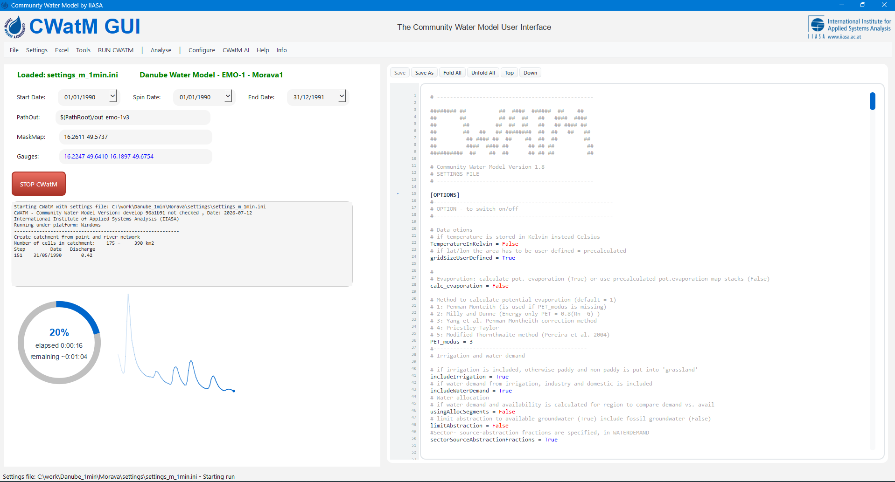

---

## 4. User Interface Overview

- **Banner** (top): the CWatM icon, the title *"The Community Water Model User
  Interface"*, and the IIASA logo. It can be hidden with **Preferences ▸ Display ▸ Show Header**
  to give the panels more room.
- **Menu bar** (directly below the banner): the whole application is menu-driven — see
  [Menus](#5-menus-and-keyboard-shortcuts).
- **Left panel**: the Start/Spin/End dates (with an optional 📅 calendar picker and a
  draggable timeline), PathOut, MaskMap and Gauges fields, the **RUN CWATM** button
  with a live *changed-fields* hint and warning label, the circular **progress clock**
  and the live **discharge sparkline**.
- **Right panel**: the **settings editor** (plain-text with syntax highlighting, a
  line-number gutter with fold markers, and bookmarks).
- **Output box** (below): a read-only, copyable log of the model run, with the
  progress clock and sparkline beneath it.

---

## 5. Menus and Keyboard Shortcuts

Menu bar (left → right): **File · Settings · Tools · RUN CWATM ·
Configure │ Analyse │ CWatM AI · Help · Info**. Recently opened files are listed
directly in the **File** menu (there is no separate History menu), and **CWatM AI**
is a clickable button, not a dropdown.

Inside the longer menus the items are grouped under **bold section headers** (for
example Settings has *View · Find & Replace · Edit · Bookmarks & Changes · Check &
Compare*; Tools has *Basin & Gauges · Outputs · Setup & Data*).
**Configure** holds a single item, *Preferences…*, which opens the settings window
described in [§15](#15-configuration-and-appearance); the **⋮** button on the far
right of the menu bar opens the same window.

| Menu | Item | Shortcut | Action |
|------|------|----------|--------|
| File | Load .ini | **Ctrl+O** | Load a settings file |
| File | Reload | **Ctrl+L** | Reload the current file from disk |
| File | Save .ini | **Ctrl+S** | Save to the current file |
| File | Save As | **Ctrl+Alt+S** | Save to a new file |
| File | (recent files) | — | Up to **6** recently opened settings files, listed directly in the File menu between Save As and Exit |
| File | Exit | — | Quit (prompts if there are unsaved changes) |
| Settings | Fold All / Unfold All | **Alt+0 / Alt+Shift+0** | Collapse / expand all sections |
| Settings | Top / Down | **Alt+T / Alt+D** | Jump to start / end of the file |
| Settings | Find | **Ctrl+F** | Open the Find & Replace window on the Find tab |
| Settings | Find next / Find previous | **F3 / Shift+F3** | Repeat the last search forwards / backwards (wraps) |
| Settings | Replace | **Ctrl+H** | Open the Find & Replace window on the Replace tab |
| Settings | Undo / Redo | **Ctrl+Z / Ctrl+Y** | Undo/redo editor **and** left-window field changes |
| Settings | Toggle Bookmark | **Ctrl+F2** | Bookmark the current line (orange gutter dot) |
| Settings | Next / Previous Bookmark | **F2 / Shift+F2** | Jump between bookmarks (wraps) |
| Settings | Clear all Bookmarks | **Ctrl+Shift+F2** | Remove every bookmark |
| Settings | Goto last change | **F5** | Jump to the most recently changed line |
| Settings | **Check settingsfile** | **F4** | **Toggle:** flag missing files/paths (relabels to *Clear checking*); press F4 again to clear — see [§8](#8-check-settingsfile) |
| Settings | Compare settings | — | Side-by-side diff of two settings files (differing lines orange, synced scrolling, Next/Previous Diff) |
| Tools | **Excel Crops/Reservoirs** | — | (directly below *Change Options*) Open the settings Excel workbook — all its sheets (*Crops*, *Reservoirs*, *Reservoirs_downstream*, …) on tabs below the table |
| Tools | Change Options | — | Boolean `[OPTIONS]` window |
| Tools | Show Basin | — | Basin viewer on an OSM map |
| Tools | Set max Gauge | — | Set Gauges to the largest-upstream point in the mask |
| Tools | Add output Watercycle | — | Add the WaterCycle output block |
| Tools | Add output variables | — | Insert an output variable that fits the current `[OPTIONS]` on an `OUT_…` line — grouped by topic, searchable by name/unit/description, **✓** on what the file already writes, and array variables ask which index (e.g. *1 - grassland*) |
| Tools | Check Data | — | Validate the settings by running CWatM's data checks (in the background, with its output and a sortable/filterable result table) |
| Tools | Create PathOut Folder | — | (first item under *Outputs*) Create the resolved PathOut directory |
| Tools | Restore settingsfile | — | Open a CWatM output `dis*.nc`: summary card + all its metadata, **preview** the settings file stored inside, **compare** it with the loaded one, restore it to a new file, list **and check** its input files, or jump to that run in the Journal |
| RUN CWATM | Run CWATM | **Ctrl+R** | Run / stop the model |
| RUN CWATM | **Journal of Runs** | — | Table of past runs; reopen results, reload settings, or Compare settings of two runs — see [§9](#9-running-the-model) |
| RUN CWATM | Hidden Run CWatM | — | Separate window that runs CWatM in its own process (several in parallel) — see [§9](#9-running-the-model) |
| RUN CWATM | **Batch Run…** | — | Run many scenarios from the loaded file (base .ini + per-row overrides, N in parallel) — see [§9](#9-running-the-model) |
| Configure | **Preferences…** | **Ctrl+,** | The window holding **every** GUI setting, on five pages — see [§15](#15-configuration-and-appearance) |
| _(menu bar)_ | **⋮** | — | The button on the far right of the menu bar — opens the same Preferences window |
| Analyse | Open PathOut Folder | — | Open the resolved PathOut directory |
| Analyse | **Output Explorer** | — | Browse PathOut; double-click a result to open the right viewer |
| Analyse | Timeseries | — | Plot a result `.csv` (+ Load observed / metrics, range slider) |
| Analyse | NetCDF | — | Show a result `.nc` on a map (+ Fast/Total timeserie, Compare A−B) |
| Analyse | Watercycle | — | Water-balance sunburst |
| Analyse | Flow Diagram | — | Water-balance Sankey |
| CWatM AI | (button) | — | Chat about CWatM, answered by Google NotebookLM — see [§14](#14-cwatm-ai-notebooklm) |
| Help | Documentation / Features / **FAQ** | — | This manual / the feature tour / common questions & troubleshooting |
| Info | About CWatM | — | About dialog |

While CWatM is running the GUI stays fully usable (you can analyse results, browse the
ledger, chat with CWatM AI, …) — only **Save** is disabled, because the run uses the
file on disk. **Save As** still works.

---

## 6. Editing Settings

The editor **is** the settings file at all times — what you save is exactly what you
see. Highlights:

- **Syntax highlighting**: section headers bold, comments grey, `True`/`False` in
  blue/red. Hovering a CWatM variable name shows its unit / description.
- **Folding**: double-click a `[SECTION]` header (or the ▾/▸ gutter marker) to
  collapse it; folded sections are still saved and searched.
- **Bookmarks**: mark lines (Ctrl+F2 or click a line number) and jump with F2 /
  Shift+F2. Preferences ▸ Editor & Dates ▸ *Bookmark Change* can auto-bookmark changed lines.
- **Change tracking**: lines that differ from the last save get a **light-blue**
  background; **Goto last change** (F5) jumps to the most recent edit.
- **Duplicate keys** are drawn in a **strong red** — CWatM flattens all sections into
  one dictionary, so a repeated key silently overrides the earlier value. (This is a
  deeper red than the light-red used by Check settingsfile for a missing file.)
- **Left-window fields** (dates, PathOut, MaskMap, Gauges) auto-apply into the
  settings after a short debounce (without saving to disk); a blue hint right of RUN
  CWATM lists which fields differ from the file. Undo/Redo cover these too.
- **Date fields**: pick the Start/Spin/End dates with a 📅 calendar popup or drag them
  on the **timeline** below the fields (the light band is the meteo-forcing coverage).
  Both are toggled in **Preferences ▸ Editor & Dates ▸ Web-style date picker / Date timeline**.
- **Change Options** (Tools) lists the boolean `[OPTIONS]` flags as tick boxes, grouped
  by topic, with a **filter box**, a **Changed only** tick, a **dot** on everything you
  changed and **Revert all** to undo the lot. Hover the small **ⓘ** beside an option to
  read what it controls and what True/False mean. **Add option…** offers switches CWatM
  understands that your file does not define yet. The window is not modal, so the editor
  stays visible; ticking a box is a single **Ctrl+Z** away, and a comment written after
  the value is preserved.

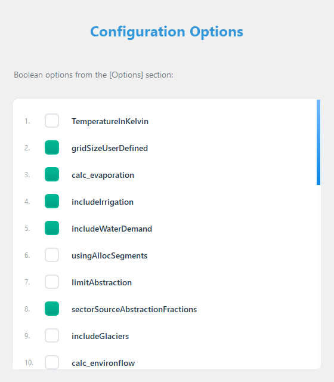

### Adding output variables

**Tools ▸ Add output variables** picks what CWatM should write, without looking anything
up in the documentation. Opening it **jumps the editor to the end of the file** (as
*Settings ▸ Down* does), because `[OUTPUT]` is the last section — the `OUT_…` lines you
are about to add to are then on screen, and so is the cursor a click inserts at.

- Only the variables that **fit your `[OPTIONS]`** are listed (no glacier output when
  glaciers are off), **grouped by topic** — snow, meteo, evaporation, soil, groundwater,
  lakes, routing, water demand, crops, balance totals, static maps.
- The **filter box searches the unit, long name and description as well as the name**,
  so *evapo* finds `actualET`.
- A **✓ (green, bold)** marks every variable your settings file already writes; the
  tooltip names the `OUT_…` keys and lines it appears on, and clicking it again removes
  it. **Only variables already in the settings file** turns the list into an overview of
  your outputs.
- Variables marked **`[index]`** are arrays — `actualET` is calculated per land cover and
  must be written `actualET[1]`. You are asked which one **by name** (*1 - grassland*,
  *0,2 - top soil layer, irrPaddy*), so an index can no longer be wrong or forgotten.
  Check settingsfile flags a wrong index from the same table.
- **Left-click** inserts at the editor cursor (on an `OUT_TSS_…` / `OUT_MAP_…` line);
  **right-click** chooses output type and time step and creates the key if needed.
- By default only the recommended (high-priority) variables are shown; **Load all
  Variable** shows all ~580. What your file already uses is listed either way, and the
  list re-reads the file whenever you come back to the window — there is no Refresh
  button.

---

## 7. Gauges, Mask and PathOut Checks

The GUI continuously validates the **live** field values (not just the saved file):

- **Gauge-in-mask**: the Gauges field text is **blue** when every gauge lies inside
  the basin, **red** if any is outside. It works for a file-based MaskMap *and* a
  coordinate-based one (the basin is generated on the fly).
- A **warning label** right of RUN CWATM shows problems in red, e.g. *"Gauge is not
  inside the basin!"* or *"PathOut does not exist!"*.
- **Tools ▸ Set max Gauge** places the gauge on the largest-upstream cell in the mask.
- **Tools ▸ Create PathOut Folder** creates the resolved output directory.

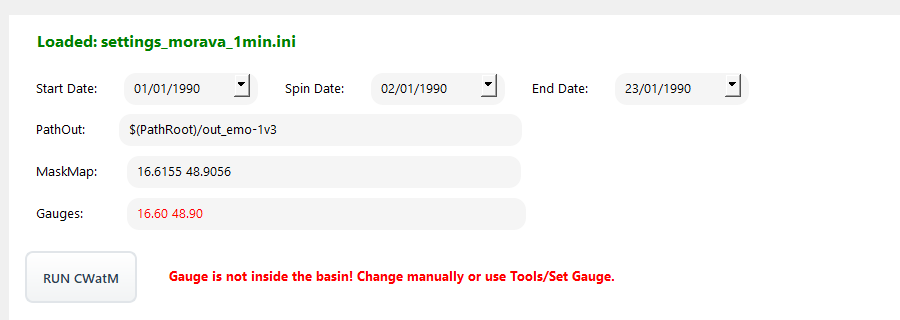

---

## 8. Check settingsfile

**Settings ▸ Check settingsfile** (F4) scans the settings as shown in the editor and
checks every value that can be identified as a **filename or path** (a `$(…)`
placeholder, a data-file extension such as `.nc/.tif/.map/.txt/.csv/.xlsx`, or an
absolute path). Placeholders are resolved from the other settings entries. **It is a
toggle** — after a scan the menu item becomes **Clear checking**; press **F4** again to
remove all the marks and bookmarks (your own bookmarks are kept).

Lines are colour-coded by severity:

- **Red + bookmarked** — the file/folder **does not exist** at all. Press **F2 /
  Shift+F2** to jump between them. Keys whose name starts with **`path`**
  (`PathRoot`, `PathOut`, `PathMaps`, …) are treated as **directories** and checked
  strictly.
- **Light orange, no bookmark — wrong extension.** The file exists but under a
  **different raster extension** than written (e.g. the value says `cellarea.map` but
  `cellarea.nc` is on disk). A likely typo, not a hard error — so it is a soft mark.
- **Dimmed light orange, no bookmark — not read.** A missing file that CWatM will not
  actually read is not flagged as an error, only dimmed. This covers:
  - a section whose `[OPTIONS]` switch is **off** (e.g. `[GLACIER]` with
    `includeGlaciers = False`), or an individual key whose gating option is off;
  - a **value-gated** file, e.g. `averageDischarge` / `averageBaseflow` are read only
    when `swAbstractionFrac < 0`; with `swAbstractionFrac ≥ 0` a missing one is dimmed;
  - **groundwater-MODFLOW input** (`PathGroundwaterModflow*` and the files routed
    through it — `modflow_basin`, `topo_modflow`, …), which is normally preprocessed
    and optional.

**Semantic checks** run too: the simulation **date ordering**
`StepStart ≤ SpinUp ≤ StepEnd`; **option dependencies** — an option switched **on** whose
required keys are missing **or point to a non-existent path** (e.g.
`modflow_coupling = True` with a bad `path_mf6dll`) — the **option line itself** is
marked, not just the path line; the validity of every `OUT_…` **output key and its
variable names**, including the **index** an array variable needs (`actualET` →
`actualET[1]`, the same table *Add output variables* offers the indices from); and
whether the run window fits inside the **meteo forcing** data's
time range (reading the precipitation/temperature NetCDFs' time axis) — catching the
common *"StepEnd is past my forcing data"* crash **before** you waste a run.

A concise summary — **only the problem lines**, with each category explained — is
written to the output box.

---

## 9. Running the Model

**RUN CWATM ▸ Run CWATM** (Ctrl+R) starts the model; the same item becomes **Stop**
while it runs.

- Output streams **live** into the output box (per-timestep date + discharge
  overwrite a single line, as on the console); errors show in dark red.
- The **progress clock** shows the percentage plus **elapsed** and estimated
  **remaining** time, frozen as *run time* / *failed after* / *stopped after* at the
  end.
- **Run mode**: the model runs in its **own OS process** — Stop is an immediate kill
  (works even if the model hangs in C code) and a model crash cannot take the GUI down.
- **Live discharge sparkline**: next to the progress clock, a small plot of the
  discharge at the first gauge over the last ~3 months. The trace is brightest on the
  right (newest) and fades out towards the left. Every so often a little animal
  (Preferences ▸ Display ▸ **Select animal**) swims along the trace.
- **Output-box log file** (Preferences ▸ Output): the run log can be appended to a file
  (`<PathOut>/cwatm_out.txt` by default, or a custom path).

Every finished run — main, Hidden or Batch — is recorded in the **Journal of Runs** (below).

### Hidden Run CWatM

**RUN CWATM ▸ Hidden Run CWatM** opens a small **separate window** that runs CWatM on
a settings file in its **own process**, independent of the main window — so the main
GUI stays fully usable and **several Hidden Run windows can run at once** (e.g. to run
different settings files in parallel).

Each window opens **pre-loaded** with the settings file currently open in the main
window (shown in **bold green**); a **Load** button picks a different `.ini`. Press
**Run CWatM** (it toggles to **Stop CWatM** while running) and the run streams into
that window's own output box.

### Batch Run

**RUN CWATM ▸ Batch Run…** runs **many scenarios** derived from the loaded settings
file. A **table** where each row is a scenario:

- a **Scenario** name and its own **PathOut** (defaulted to `<base PathOut>_<name>` so
  runs don't collide; the folder is created automatically);
- per-scenario **key = value overrides** — add a column with **Add key column**, which
  takes the key from the settings-editor's **cursor line** (put the cursor on the key
  you want to vary, e.g. `SnowMeltCoef`, then press the button).

Set **Parallel runs** (1 = sequential) and press **▶ Run all**; each row shows a live
**Progress / Status**. **Stop all** kills everything; **Clear** starts fresh. The
scenario table is **remembered** between sessions. Each finished scenario is written to
the Journal of Runs.

For a **parameter sweep** (sensitivity analysis / manual calibration), press **Sweep…**
and enter one `key: values` line per parameter — the values as a **list**
(`SnowMeltCoef: 3.5, 4.0, 4.5`) or a **range** `min:max:step` (`3.5:4.5:0.5`). Several
keys generate the **full grid** of combinations; the rows (with their own PathOut per
combination) are filled in for you.

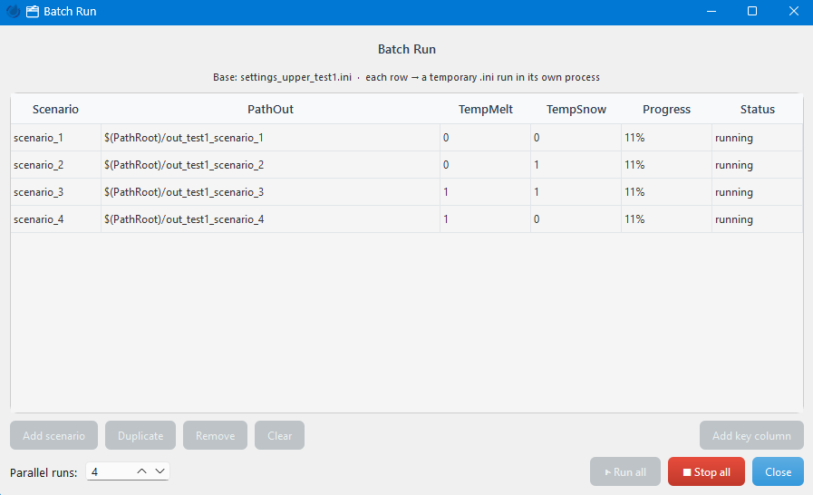

### Journal of Runs

**RUN CWATM ▸ Journal of Runs** (the 2nd item in that menu) is a table of your **past runs** (main, Hidden and Batch) — time,
Title, PathOut, duration, success and last discharge. Select a run and:

- **Open results** — its PathOut in the Output Explorer;
- **Load settings** — reopen its settings file in the main window;
- **Compare settings** — mark **two** runs (Ctrl/Shift+click) and diff the settings each
  one actually used (a snapshot is kept per run, so the diff is correct even if you edit
  the file later).

Where the ledger is stored and how long runs are kept are set in **Preferences ▸ Run
History** (default: keep 60 days under
`%LOCALAPPDATA%\CWatM_GUI`).

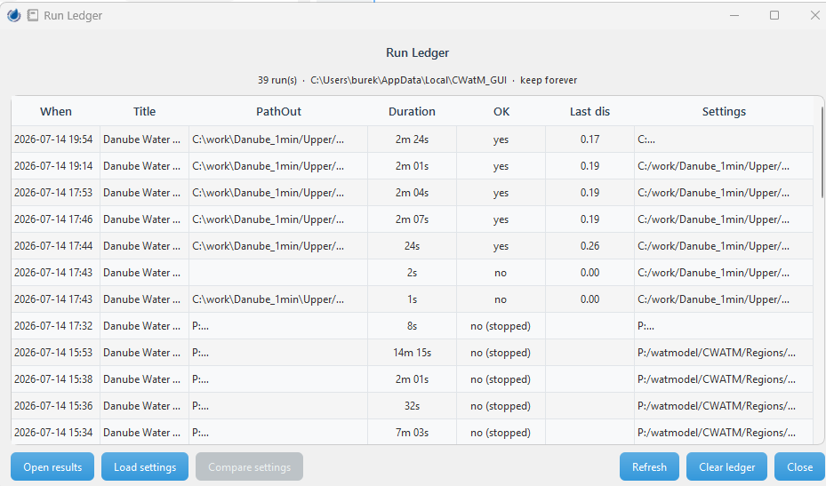

---

## 10. Show Basin

**Tools ▸ Show Basin** opens the basin viewer — a Leaflet (**EPSG:4326**) map with the
`ups.nc` upstream-area river network and the catchment **mask** overlaid on an OSM
basemap, drawn in native lon/lat (no reprojection blur). Projected x/y grids (e.g.
UTM33) are shown on the raw x/y without an OSM basemap.

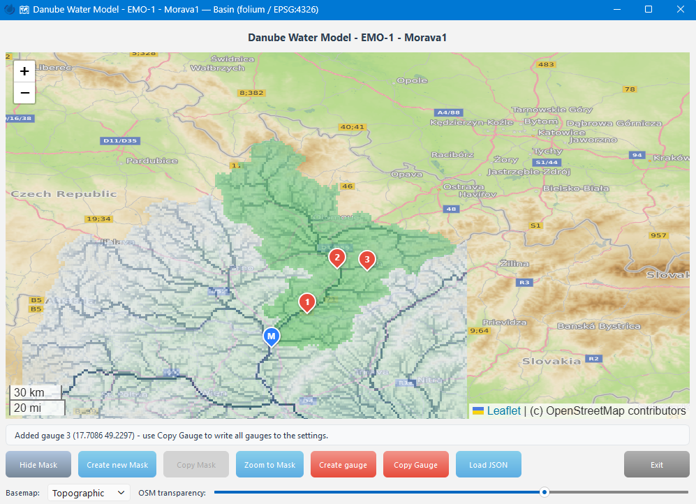

- **Markers**: red pins = the gauges (numbered `1..N`, taken from the Gauges box),
  a blue **M** = the mask-start, black = the last clicked cell.
- **Click** anywhere to read the coordinates, basin area and mask state in the strip
  under the map.
- **Buttons**: Hide/Show Mask, Create new Mask, **Copy Mask**, Zoom to Mask, Create
  gauge / **Copy Gauge** (accumulate several gauges, then commit them all to the
  Gauges box), **Load JSON** (overlay a GeoJSON), Exit. **Clicking a gauge pin removes
  it** from the working list.
- **OSM transparency slider**: fades between only-the-data and the OSM basemap with the
  data on top; the start value comes from Preferences ▸ Display ▸ Initial map transparency. A **Basemap**
  dropdown switches the OSM style.

---

## 11. Check Data

**Tools ▸ Check Data** runs CWatM's own data checks against the settings (input maps,
resolutions, extents) and lists any trouble in a table. It works only with a
**file-based MaskMap** (not coordinates) — with a coordinate MaskMap the **Run Check**
button is disabled and says why. It can also compare against an existing discharge
NetCDF, and **Restore settings from discharge map** opens that file in
[Restore settingsfile](#136-restore-settingsfile--what-a-result-file-remembers).

The check **runs in the background**: the window (and the rest of the GUI) stays usable
while it reads every input file, with an elapsed-time counter, and **CWatM's output
appears in the log pane** below the table — including the traceback when something
fails. Because CWatM reads the settings **from disk**, unsaved changes are pointed out
before the check starts, with the option to save first.

The result table can be **sorted** by any column and narrowed with the **filter box**;
rows with a problem are tinted across their whole width, and the line above the table
counts them (*"312 rows · 7 not valid · 3 date mismatches"*). **Select trouble** keeps
only those rows, **Copy Table** and **Export CSV** take what is on screen, and a
**double-click on a row jumps to that key** in the settings editor. The result CSV is
written to `<PathOut>/check_cwatm1.csv` by default.

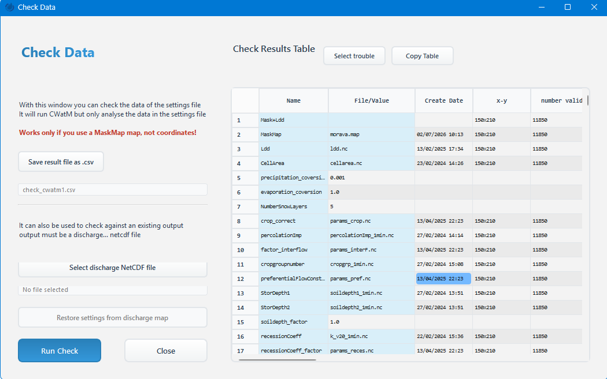

---

## 12. Excel Editor (Crops / Reservoirs)

**Tools ▸ Excel Crops/Reservoirs** — directly below *Change Options* — opens the workbook named in the
settings `Excel_settings_file` in an editable table that **reproduces the sheet's cell
colours** (fill and font).

- **Sheet tabs**: just like in Excel, a **tab bar below the table** (above the
  "N rows × M columns" line) lists **all** the workbook's sheets — *Crops*,
  *Reservoirs*, *Reservoirs_downstream*, *Reservoir_transfers*, … Click a tab to switch;
  a sheet holding unsaved edits is marked with a `*` on its tab.

  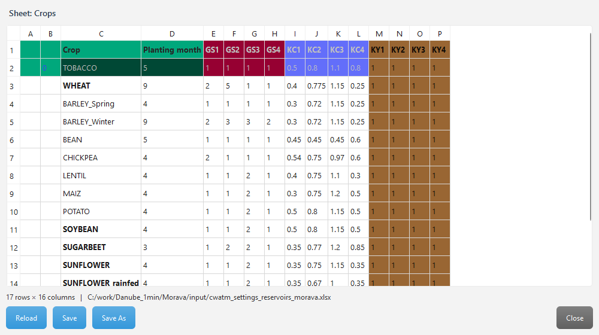

  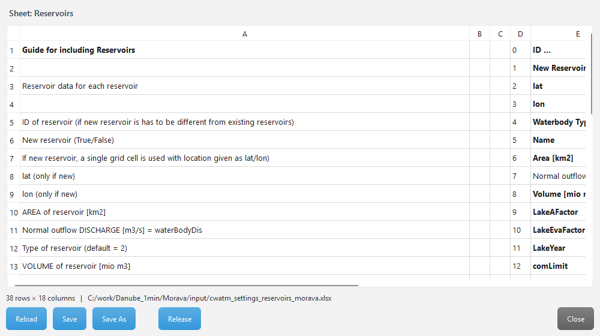

- Cells are **editable**; **Save / Save As** write the edits of **every** sheet you
  changed back through the workbook, **preserving all other sheets and styling**.
  **Reload** re-reads the workbook from disk and **Load** opens a different `.xlsx` in
  the same window (both ask first if there are unsaved edits). Very large sheets load
  instantly (the table is lazy — only the visible cells are read).

- **Closing with unsaved edits** asks **Save / Discard / Cancel** and names the sheets
  that still hold changes, so nothing is lost by closing the window.

- **Loading does not freeze the GUI**: the workbook is read in the background — the
  window shows *Loading …* and comes alive when the file is there. This is what you
  notice with a workbook on a network drive, where reading a megabyte can take half a
  minute.

### Working in it like in Excel

| What | How |
|------|-----|
| **Formulas** | Type `2+3.5`, `2 + I3`, `=(A1+B1)/2`, `=SUM(C2:C10)`. The cell shows the **result**; clicking into it shows the formula again, and it recalculates when a referenced cell changes. Functions: `SUM`, `AVERAGE`, `MIN`, `MAX`, `COUNT`, `ABS`, `ROUND`, `INT`, `SQRT`, `EXP`, `LN`, `LOG10`, `LOG`, `MOD`, `POWER`; ranges like `A1:B10` work inside them. A bad formula shows `#NAME?`, `#DIV/0!`, `#VALUE!`, `#SYNTAX` or `#CYCLE`. Prefix with `'` to keep the text as it is. |
| **Copy / paste** | Select one cell or a block, **Ctrl+C** (or **Ctrl+X**), put the cursor somewhere and **Ctrl+V**; **Delete** clears the selection. The same four are on the **right-click menu** over the cells. The clipboard format is tab-separated text, so you can paste into — and from — Excel, a text editor or the settings file. A paste that runs past the last row or column **extends the sheet**. |
| **Fill handle** | Select one or more cells and drag the **small square at the bottom-right corner** down, up, left or right. **A single cell fills its value into all the others.** From two or more cells a series is continued: numbers with a constant step (`1, 3` → `5, 7, …`), `Crop1, Crop2` → `Crop3, Crop4`, month/weekday/quarter names, and anything else repeats the block. |
| **Marking a whole line** | Click a column letter or a row number to mark the whole line — a full-line selection is shown in a **stronger gray** than an ordinary cell range. |
| **Whole columns and rows** | **Right-click a column header** for *Copy column*, *Insert empty column left / right*, *Paste N columns left / right* (it makes room for the block instead of overwriting) and *Delete column*. **Right-click a row number** for the same, with *above / below*. Marking several columns (or rows) first makes every action work on all of them. Deleting asks first when there is data in the line, and the question tells you whether **Ctrl+Z** can bring it back (only a very large deletion cannot be undone — then **Reload** is the way back). |
| **Where a copied column may go** | A full column or row can only be copied with **Copy column / Copy row in the header menu** (Ctrl+C over cells copies just those cells). Such a copy remembers what it is and where it came from, so a copied **row** is never offered as a column to paste, and a column can only be pasted back into **the sheet it was copied from** — the menu entry stays visible but greyed out, and its tooltip says why. A plain block of copied cells has no such restriction. |
| **Wide text columns** | No column is ever wider than about **120 characters**, and a column of text is shown at **half** that width and **wraps**, so the numeric columns stay visible. Drag the column border to make it wider or narrower — the text re-wraps and the rows re-height. |
| **Text that does not fit** | is **cut off at the column's edge** (with a `…`) — it is never drawn across the next column, where it would sit on top of that column's content. Widen the column to read the rest. Columns are sized to their content **and their header**, and a few known columns get a guaranteed minimum (the reservoir IDs in *Reservoir_transfers*, the description column of *Reservoirs*). |
| **Symbol bar** | Top left of the window: **⧉ copy · ✂ cut · 📋 paste · 🗑 delete │ B bold │ ↶ undo · ↷ redo**. Each button does exactly what its shortcut does, and is greyed out while it cannot be used (nothing selected, empty clipboard, nothing to undo). |
| **Bold** | Mark one or more cells and press **B** in the symbol bar (or **Ctrl+B**): the cells turn bold, and pressing it again on cells that are all bold takes the bold off. It is written into the workbook when you save, and **Ctrl+Z** undoes it like any other change. |
| **What is marked** | Marked cells are shown in **dark gray**; a whole marked column or row in an even darker shade, so the two are easy to tell apart. |
| **The header row** | The sheet's first row sits above the table and **never scrolls** — clicking it or spinning the mouse wheel over it scrolls the table underneath instead, so the header cannot get lost. It is **editable up there**: double-click a header cell (or press F2, or simply start typing) to rename a column; the change is undoable and is written when you save. Marking cells in the header row and pressing **B**, Delete, Ctrl+C/X/V or Ctrl+Z works on the header row, not on the table below — the buttons and shortcuts always act on the part you last worked in. |
| **Undo / redo** | **Ctrl+Z** undoes and **Ctrl+Y** (or Ctrl+Shift+Z) redoes — cell edits, pastes, fills, clears, **and** inserted or deleted whole columns and rows, up to 200 steps. Every sheet keeps its own history, and undo keeps working after a Save. |

> **Note** — a formula is saved as its **computed value**. CWatM reads these sheets with
> pandas/openpyxl, which cannot evaluate a stored formula, so writing the number is what
> keeps the workbook usable as model input. The formula stays live while the window is
> open.

---

## 13. Result Analysis

The **Analyse** menu visualises CWatM results. Each window has a **Save HTML** button
that exports the current, self-contained plot.

### 13.1 Output Explorer

**Analyse ▸ Output Explorer** is a browser of the resolved **PathOut** folder:
**double-click** a result and it opens in the matching viewer — `.nc` → NetCDF map,
`WaterCycle*.csv` → sunburst, other `.csv` → Timeseries. It turns "run → analyse" into
one click instead of a file dialog.

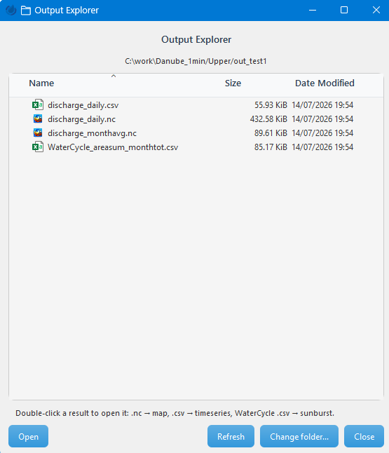

### 13.2 Timeseries

**Analyse ▸ Timeseries** plots a result `.csv` (e.g. `discharge_daily.csv`) as a line
chart. Multiple columns are shown one at a time (Forward/Backward); **Compare**
overlays another result file; **Save as csv** exports the shown series in the CWatM
result-CSV format.

- A **range slider** below the plot shrinks the displayed period from either end.
- **Load observed** overlays an observed series (a CWatM `.csv` or a simple
  `date,value.csv`) and shows goodness-of-fit metrics — **KGE / NSE / PBIAS / RMSE** —
  computed over the period the slider selects. This is the model-evaluation step you no
  longer need Excel/Python for.

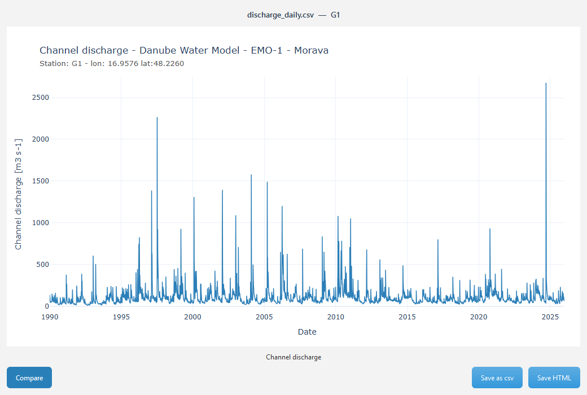

### 13.3 NetCDF

**Analyse ▸ NetCDF** shows a result `.nc` (e.g. `discharge_daily.nc`) as a raster
overlay on an OSM map (EPSG:4326). A **timestep slider + Play** scrubs through time; a
**colour-scale** selector, **Log scale** toggle and **OSM transparency** slider tune
the display. Click a cell to read its value. The left-window gauges appear as small
numbered red pins.

- Plot a clicked cell's series with **Fast Display Timeserie** (quick — the map's
  timesteps only, with gaps) or **Total Timeseries** (every timestep — can take a while,
  so a progress bar shows next to the buttons).
- **Compare A−B** loads a second `.nc` on the same grid and shows the **difference**
  (this − other) per timestep on a red/blue diverging scale — ideal for comparing two
  scenarios you just ran. **Clear compare** returns to the single-file view.

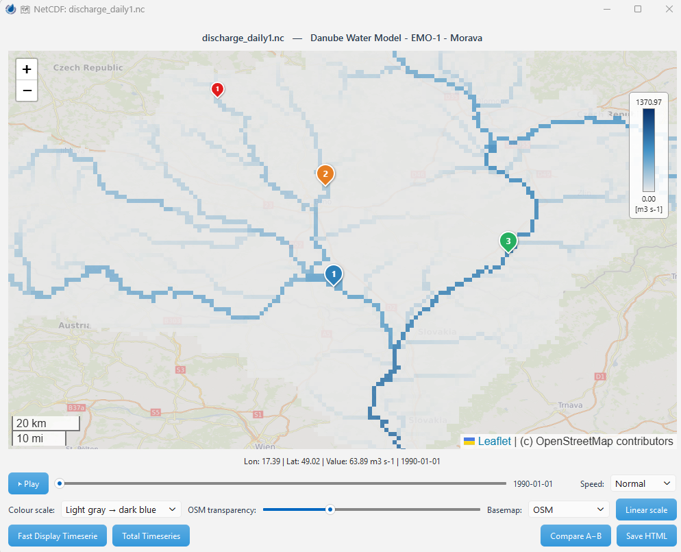

### 13.4 Watercycle

**Analyse ▸ Watercycle** reads a `WaterCycle_areasum_monthtot.csv` and shows the
overall water balance as a **sunburst** (Inputs / Outputs / Storage /
Evapotranspiration / Transpiration). A month **range slider** selects the period.

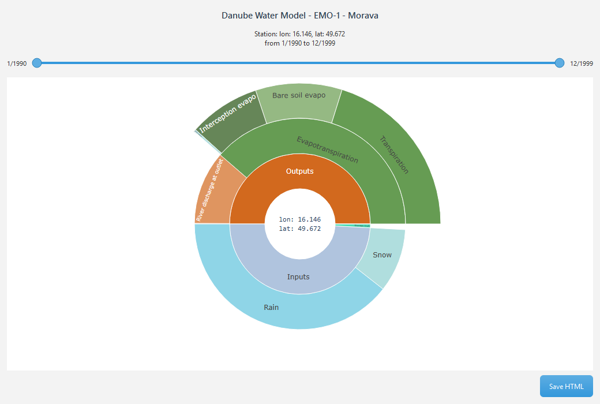

### 13.5 Flow Diagram

**Analyse ▸ Flow Diagram** shows the same water balance as a **Sankey** flow diagram
(Precipitation → Rain/Snow → Soil/Groundwater/Runoff → Waterbodies → Discharge, plus
withdrawal/consumption), over the slider-selected months.

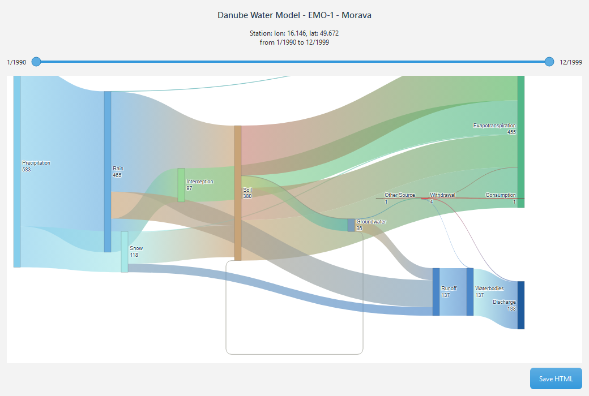

### 13.6 Restore settingsfile — what a result file remembers

Every CWatM discharge/ET output file carries the **complete settings file** and the
**list of input files** the run used. **Tools ▸ Restore settingsfile** opens such a
`dis*.nc` and shows what is inside — a **summary card** (Title, when it was created,
which CWatM version, which settings file) above the full attribute table:

- **Preview settingsfile** — read the stored settings in a read-only editor, with the
  usual colouring and folding, *before* deciding anything. From there: **Save as…**,
  **Load into editor (unsaved)** — the settings go into the main editor without writing
  any file, and one **Ctrl+Z** takes it back — or **Compare with current**.
- **Compare with current** — a side-by-side diff of the stored settings against the ones
  you have loaded: what did this run do differently?
- **Restore settingsfile** — write the stored settings to a new file and load it. The
  suggested name is `<title>_<run date>.ini`, and unsaved edits in your current file are
  pointed out first.
- **Show Inputfiles** — the recorded input files with the date the run saw, plus a
  **check**: is each file still there (**missing**, red), is it still the same version
  (**changed since the run**, orange), or is everything as it was? A line above counts
  them, **Re-check files** repeats it, and a **double-click opens the file** — a NetCDF
  in the map viewer, anything else in your desktop's program for it.
- **Show in Journal** — jump to the run that wrote this file in the Journal of Runs.
- **Ctrl+C**, a right-click menu and **Export as CSV** work on both tables. Buttons a
  file cannot serve (an output without stored settings) are greyed out with the reason.

---

## 14. CWatM AI (NotebookLM)

The **CWatM AI** button (left of *Help*) opens a chat window where questions about
CWatM are answered by Google **NotebookLM** (Gemini). NotebookLM is a *grounded* AI: it
answers only from the **sources in a notebook** — for CWatM that is the CWatM
documentation — which makes answers verifiable and greatly reduces made-up replies.

Because it talks to **your own** NotebookLM account, CWatM AI needs (a) a **notebook
that contains the CWatM sources** and (b) a **one-time Google sign-in**. The two steps
below get you there.

### 14.1 Prepare a NotebookLM notebook with CWatM sources *(one-time)*

Do this once in your browser at **notebooklm.google.com**:

1. **Sign in** to NotebookLM with a personal Google account (or a Workspace/school
   account — those may need administrator approval). If it is your first visit, complete
   any **age verification** Google asks for (Google Account → *"Access age-restricted
   content and features"*). *If NotebookLM works in the browser, CWatM AI can use it.*
2. **Create a new notebook** and give it a title that contains the word **"CWatM"**
   (e.g. `CWatM`). CWatM AI auto-selects the notebook whose title contains *cwat*, so
   this name lets the GUI find it with no further configuration.
3. **Add the CWatM sources.** Upload the CWatM documentation PDFs as sources. The GUI
   ships one ready to use — **`documentation/CWATM_shorter.pdf`** — and you can add
   more for deeper coverage:
   - `CWATM_shorter.pdf` (the condensed CWatM documentation — a good default),
   - the CWatM model-description papers (e.g. the *GMD* CWatM papers), the supplement,
     and any of your own CWatM notes/protocols.
   The more focused and CWatM-specific the sources, the better the answers.
4. Wait until NotebookLM shows every source as **ready** (green), then ask it a test
   question in the browser to confirm the notebook works.

> You can keep several notebooks. If you prefer a specific one, copy its **id or URL**
> from the browser and paste it into **Notebook…** in the CWatM AI window (or leave it
> on *auto* and rely on the "CWatM" title match).

### 14.2 Sign in from CWatM (one click)

Open **CWatM AI** and click **Login…**. CWatM AI **auto-detects** the browser you are
signed in to Google with — it tries **Firefox → Chrome → Edge → Opera** in turn,
verifies each session against NotebookLM, and stops at the first one that works:

```
Looking for a signed-in Google session in your browsers…
Trying Firefox…      ✗
Trying Chrome…       ✓  Logged in via Chrome.
```

- The login-state line at the top of the window shows **✓ Logged in** (blue) once a
  working session is confirmed, **Checking…** while it verifies, or **Login required**
  (red) when you need to sign in.
- **On Windows, Chrome / Edge / Opera encrypt their cookie store** (app-bound
  encryption), so CWatM can only read them when it is **run as administrator**.
  **Firefox** works without elevation and is tried first — the easiest path is to be
  signed in to Google in Firefox.
- If auto-detect can't find a working session it explains why and offers **Choose
  browser…**, the manual fallback: pick a specific browser, or (running from source
  only, with `playwright` installed) the interactive **Google login window**.
- After a successful login the session is **stored and reused automatically** on later
  runs — you normally sign in only once, until Google expires it.

### 14.3 Using the chat

- **Ask a question:** type in the input box and press **Enter** (**Shift+Enter** for a
  new line) or click **Send**. Answers stream back and are rendered as **Markdown**
  (bold, lists, tables, code). While a question is in flight, **Send** becomes **Stop
  thinking** to cancel it.
- **Answer length:** the **Short / Medium / Long** toggle sets how detailed replies are
  (Short is fastest). Your choice is remembered.
- **Question history:** press **Up / Down** in the input box to recall previous
  questions. The transcript and history are **kept across close/open**.
- **Explain current line:** the **Explain current line** button (or typing "explain
  this line") asks NotebookLM to explain the settings line your editor cursor is on.
- **Notebook… / Clear / Exit:** point at a specific notebook, clear the transcript, or
  close the window (your session and history are saved either way).

### 14.4 Getting good answers

- **Be specific.** Instead of *"explain routing"*, ask *"What does the `PathOut` option
  control and what files are written there?"* — precise keywords retrieve the right
  passage.
- **Verify with the sources.** Answers point back to the notebook sources; read a little
  around a cited snippet to be sure a detail wasn't taken out of context.
- **It stays inside its sources.** A refused / "not found" answer usually means the
  question is **outside the CWatM sources** — add a relevant source to the notebook or
  rephrase with exact CWatM keywords.

> CWatM AI is an **experimental** aid. Its grounding makes it far more accurate than a
> generic chatbot, but verify against the CWatM documentation and code before relying on
> it for a decision. For the full NotebookLM feature set, use **notebooklm.google.com**
> directly — the CWatM AI window is a focused chat client over your CWatM notebook.

A dedicated guide is also in **`documentation/CWatM_AI_NotebookLM.md`** (Help ▸ FAQ links
to it).

---

## 15. Configuration and Appearance

All GUI settings live in one **Preferences** window, opened with
**Configure ▸ Preferences…**, **Ctrl+,**, or the **⋮** button on the far right of the
menu bar. Pick a category in the list on the left — *Output · Startup & Model ·
Display · Editor & Dates · Run History* — and set it on the page that appears.

Your edits are **buffered**: **Apply** puts them into effect and leaves the window
open, **OK** applies them and closes, and **Cancel** discards anything not yet
applied. All settings are persisted across sessions (except *Write output box*, which
always starts off).

**Output**

- **Output box file** — the file the output box is appended to, with a **Browse…**
  button. Leave it empty to use the default `<PathOut>/cwatm_out.txt` (shown greyed in
  the field).
- **Write output box** — actually write the run log to that file. This one is *not*
  remembered: it always starts off, because logging can slow a run down on a network
  share.

**Startup & Model**

- **Load previous settings at start** — re-open the last settings file automatically at
  the next startup.
- **Use Modflow** — pre-load the MODFLOW coupling library (flopy) so MODFLOW runs/checks
  are ready; off (default) keeps startup fast. *(A MODFLOW run also needs `xmipy` and the
  MODFLOW 6 library `libmf6`, whose path you set in the settings — the GUI does not ship
  the DLL.)*

**Display**

- **Mode** — colour theme of the whole GUI: **Normal** (light), **Dark**, **Mikhail**
  (black + amber). Switches live and is remembered.
- **Show Header** — show or hide the top banner (CWatM icon + title + IIASA logo).
  Turning it off moves the menu, panels and editor up to reclaim the space.
- **Show decimals** — how many decimals every numeric read-out shows (default 3).
- **Initial map transparency** — the transparency (0–100 %) that Show Basin and NetCDF
  open with.
- **Default openstreet map** — the default basemap for the map windows.
- **Select animal** — the little animal (Fish / Otter / Beaver / Sailboat / …) that
  occasionally appears on the live discharge sparkline during a run.

**Editor & Dates**

- **Skill of user** — **Beginner / Advanced / Expert**: how much of the settings file is
  shown (the sections above your level are hidden). Same setting as the coloured level
  button next to the editor.
  **Beginner also simplifies the menus** — the entries you do not need for a first run
  are hidden: *Tools ▸ Add output Watercycle · Change Options · Excel Crops/Reservoirs ·
  Check Data · Restore settingsfile*, *RUN CWATM ▸ Journal of Runs · Hidden Run CWatM ·
  Batch Run…*, and *Analyse ▸ Watercycle · Flow Diagram*. Switch to **Advanced** or
  **Expert** to get them back; nothing is removed, only hidden.
- **Web-style date picker** — the Start/Spin/End fields use a 📅 button + calendar
  popup (on) or the classic drop-down calendar (off).
- **Date timeline** — show the three-handle Start/Spin/End timeline below the date
  fields; drag a handle (or click the track) to set a date. The light band behind it is
  the meteo-forcing coverage.
- **Bookmark Change** — auto-bookmark a line when it is edited.

**Run History**

- **Run history folder** — where the **Journal of Runs** is stored, with a **Browse…** button
  (default `%LOCALAPPDATA%\CWatM_GUI`).
- **Run history retention** — how many days of runs to keep; **0** shows as
  *keep forever*.

---

## 16. Building the Executable and Installer

The one-folder build is produced with PyInstaller from `cwatm_gui_dir.spec`:

```bash
pip install -r requirements.txt -r requirements_build.txt
python -m PyInstaller cwatm_gui_dir.spec --noconfirm
```

The result is `dist/CWatM_GUI/CWatM_GUI.exe` (plus an `_internal/` folder that also
contains the lightweight `CWatM_model.exe` child process used for model runs). The
spec collects rasterio + GDAL data, xarray backends, folium/plotly, **openpyxl**,
requests, QtWebEngine, the **MODFLOW** stack (flopy + matplotlib + xmipy), the CWatM AI
libraries (`notebooklm` + `rookiepy`), the `cwatm`/`src` code and the documentation.

To wrap that folder into a **per-user installer** (no administrator rights), compile the
Inno Setup script:

```bash
ISCC installer\CWatM_GUI.iss        # -> installer\Output\CWatM_GUI_Setup.exe
```

The installer copies `dist\CWatM_GUI\` verbatim (keeping `_internal\` intact), offers a
desktop shortcut and an optional `.ini` "Open with" association, and installs into the
current user's locations. Reference notes: `cwtmexe.md`, `makeitfaster.md`,
`installer/CWatM_GUI.iss`.

---

## 17. Troubleshooting

- **A map or plot is blank** — the map/plot windows need QtWebEngine; behind a
  corporate proxy the tiles are fetched with Python (proxy-proof). If the OSM basemap
  is missing, only the tiles failed — the data overlay and controls still work.
- **"Gauge is not inside the basin!"** — move the gauge (Tools ▸ Set max Gauge or the
  basin viewer's Create/Copy Gauge), or fix the MaskMap.
- **"PathOut does not exist!"** — Tools ▸ Create PathOut Folder.
- **Check settingsfile flags a line** — red = the resolved file/folder was not found
  (the output box lists the resolved path; `Path…` keys are checked as directories);
  **light orange** = the file exists under another extension, or is not read with the
  current options (a soft note, not an error); a **strong-red** line means a *duplicate
  key*, not a missing file.
- **The run stops early with a date/time error** — the run window is likely past your
  forcing data; run **Check settingsfile** (F4), which warns when `StepEnd` is after the
  meteo forcing ends.
- **CWatM AI says "Login required"** — the Google session expired, or none was found.
  Click **Login…** (Firefox needs no admin; for Chrome/Edge/Opera run CWatM as
  administrator). Make sure your NotebookLM notebook (title contains "CWatM") has its
  CWatM sources uploaded — see [§14.1](#141-prepare-a-notebooklm-notebook-with-cwatm-sources-one-time).
- **A MODFLOW run fails** — it needs `xmipy` + `flopy` installed and the `libmf6`
  library path set in the settings; enable **Preferences ▸ Startup & Model ▸ Use Modflow** for a faster
  first use.
- **Diagnostic log** — swallowed errors are written to
  `%LOCALAPPDATA%/CWatM_GUI/gui.log`.

**More answers:** a fuller FAQ is in-app under **Help ▸ FAQ**
(`documentation/CWatM_GUI_FAQ.md`).

---

## 18. Versioning

The **CWatM GUI** carries its own version number, independent of the CWatM model
version it drives. The current release is **Version 1.05**.

You can see it in-app under **Info ▸ About CWatM**, where **CWatM GUI version 1.05**
is shown above the **CWatM Version** block (the latter reports the model's Git
branch, hash and build time).

**Bumping the version** is a single edit: `__version__` in **`src/gui/__init__.py`**
is the only place the number is written down in the code. The About dialog reads it,
and `installer/CWatM_GUI.iss` scrapes that same line with its preprocessor at compile
time (aborting the build if it cannot find it), so the app and the installer can never
disagree. Only this manual — the header above and the table below — needs its own edit.

| Version | Date | Notes |
|---------|------|-------|
| 1.05 | 11/08/2026 | The four settings/validation windows reworked — see [CWatM_GUI_Version_1.05.md](CWatM_GUI_Version_1.05.md). **Change Options**: grouped by topic, ⓘ explanation per switch, filter, *Changed only*, change marks, *Revert all*, *Add option…*, and a trailing comment is no longer lost (nor the whole option hidden). **Add output variables**: grouped, searches unit/description, ✓ on what the file already writes, and an array variable's index picked **by name**. **Restore settingsfile**: summary card, preview, compare with the current file, load unsaved, and an input-file check (still there? still the same version?), plus *Show in Journal* and CSV export. **Check Data**: runs in the background with its output in the window, warns about unsaved edits, sortable/filterable table with problem rows tinted and counted, and a double-click jumps to that key in the settings file. |
| 1.04 | 10/08/2026 | Moved the Excel workbook editor into **Tools ▸ Excel Crops/Reservoirs** (the Excel menu is gone) and extended it: bold, an editable header row that never scrolls away, undo/redo, a symbol toolbar, better column widths and no text spilling between columns. **Batch Run** rewritten around safety and analysis: a pre-flight check, a log per scenario, a row menu, duration/ETA, CSV import & export, result comparison and resume. |
| 1.03 | 07/08/2026 | Added selection of map/tss to Tools ▸ Add output variables. Put the options of the Configure menu into a Preferences window. |
| 1.02 | 02/08/2026 | Added User skill Beginner, Advanced, Expert. |
| 1.01 | 26/07/2026 | Changed CWatM AI function and login, changed the layout of the menu. |
| 1.00 | 22/07/2026 | First version. |

---

*This manual is also available in-app under **Help ▸ CWatM GUI Documentation**; the
shorter feature tour is under **Help ▸ CWatM GUI Features**, and common questions under
**Help ▸ FAQ**.*


