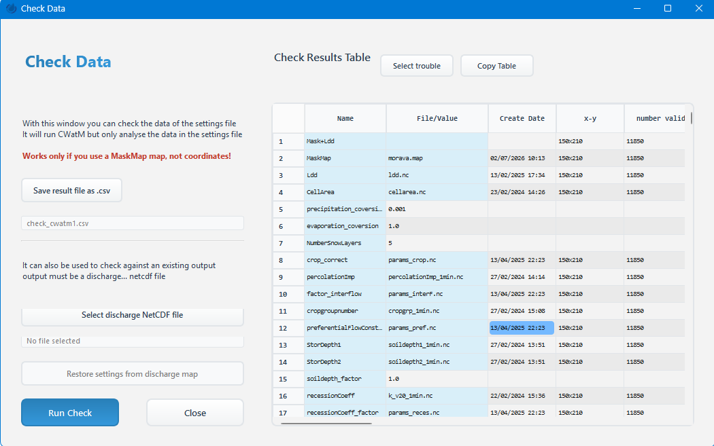
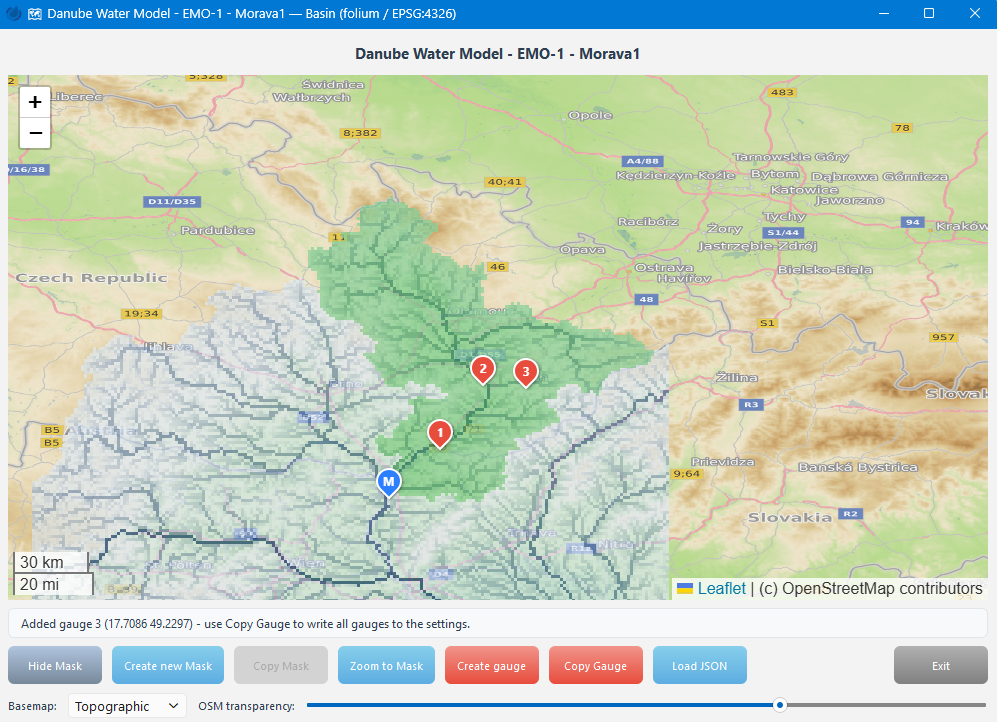
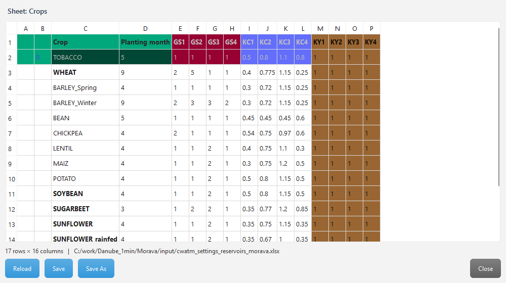
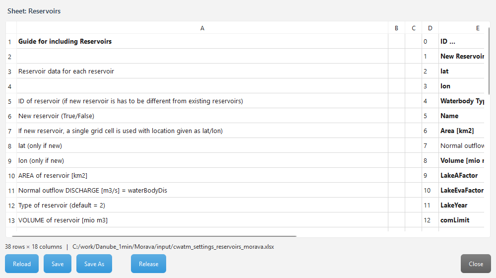
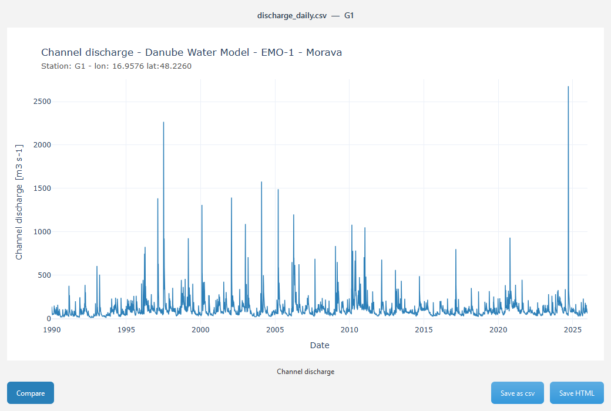
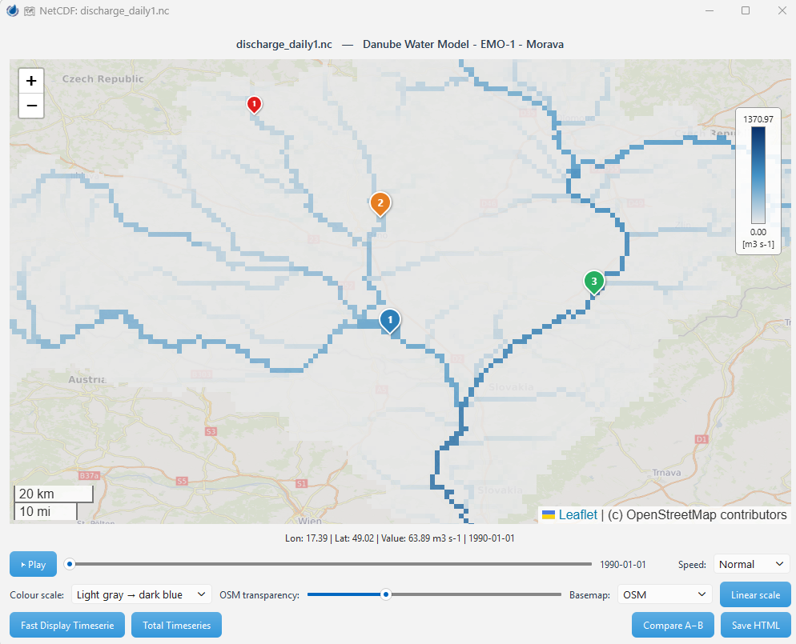
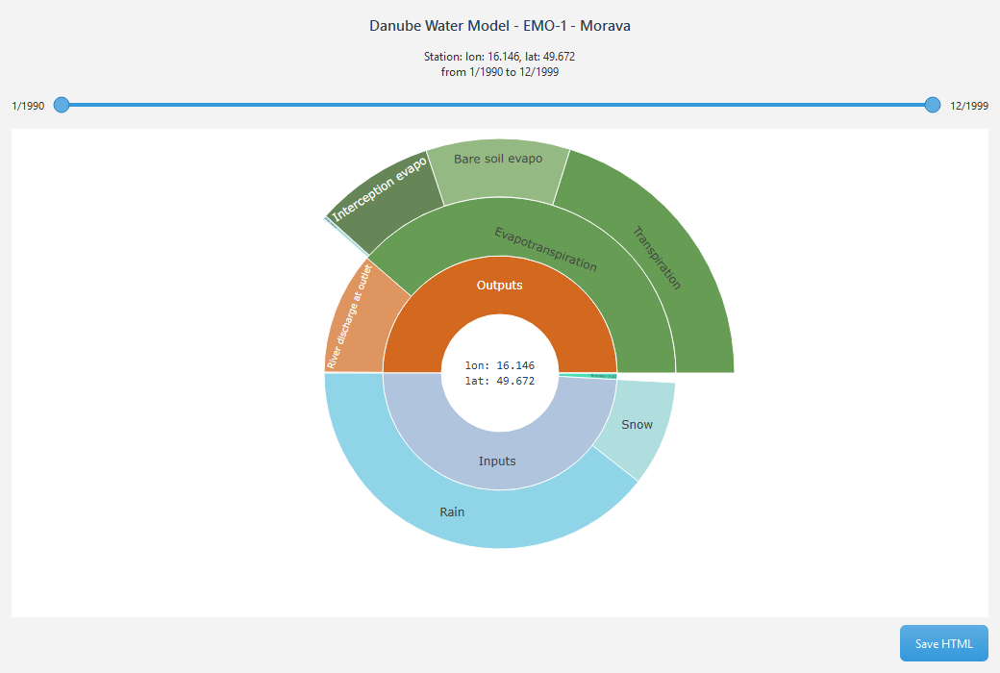
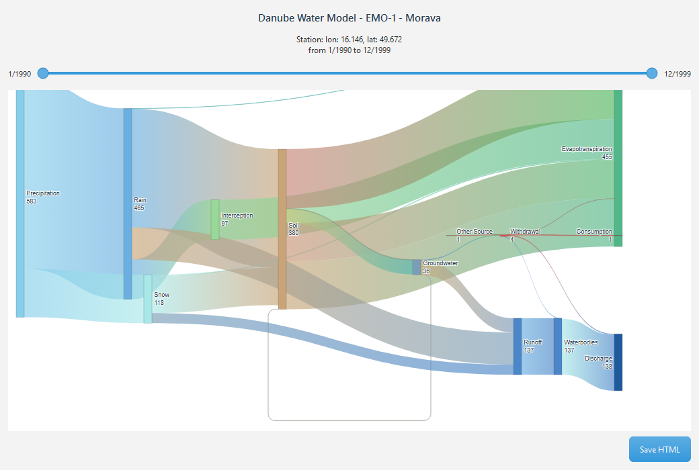

# CWatM GUI — Feature & Usage Guide

> This is the user-facing feature/usage tour for the CWatM GUI. The concise,
> developer-facing reference (menu table, architecture, build) lives in the
> project root `CLAUDE.md`.

## Features

### File Management
- **Load Configuration Files**: Load INI files with a preselected `.ini` filter.
- **Load previous settings at start** (Configure): when ticked, the last settings file
  you had open is re-opened automatically the next time the GUI starts.
- **Recent files**: up to 6 recently opened settings files are listed directly in the
  **File** menu (between Save As and Exit).
- **Save Files**: Save to the same file or Save As a new file — the editor holds the
  file as plain text at all times, so exactly what you see is saved (folded sections
  are only hidden from view and are written in full).
- **Auto-apply (no save)**: changing Start/Spin/End Date, PathOut, or MaskMap updates
  the settings content in memory automatically (debounced ~500 ms); writing to disk
  only happens on Save / Save As.
- **Section Management** (Settings menu): **Fold All** (Alt+0) collapses all sections;
  **Unfold All** (Alt+Shift+0) expands them.
- **Navigation** (Settings menu): **Top** (Alt+T), **Down** (Alt+D), **Find** (F5) /
  **Find next** (Ctrl+F), **Undo** (Ctrl+Z) / **Redo** (Ctrl+Y). Undo/redo cover both
  manual editor edits and left-window field changes (Date/PathOut/MaskMap/Gauges).
- **Bookmarks** (Settings menu): **Toggle Bookmark** (Ctrl+F2) — or click a line's
  number in the gutter — marks the current line with an orange dot; **Next /
  Previous Bookmark** (F2 / Shift+F2) jump between them (wrapping around);
  **Clear all Bookmarks** (Ctrl+Shift+F2) removes them all.
- **Unsaved-change highlight**: lines that differ from the last loaded/saved file are
  shown with a light-blue background until the file is saved.
- **Duplicate-keyword highlight**: lines whose keyword is defined more than once are
  shown with a light-red background (the later definition silently overrides the
  earlier one; `OUT_*` output keys are per-section and only flagged if repeated
  within the same section).

### Configuration Parsing
- **Automatic Parsing** on load, with syntax highlighting and section folding.
- **Visual Formatting**:
  - Comments (`#`) in dark gray
  - `True` values in blue
  - `False` values in red
  - Section headers in bold
- **Foldable Sections**: click a section's ▾/▸ marker in the line-number gutter (or
  double-click its `[SECTION]` header) to fold/unfold it; all sections are unfolded
  when a file is loaded. Folding only hides lines — they stay in the saved file, and
  Find automatically unfolds a match inside a folded section.
- **Line-number gutter**: shows file line numbers (numbers jump across a folded
  section, so you can see how many lines are hidden).
- **Whitespace Preservation**: original file formatting and spacing are maintained.

### Date Management
- **Three Date Fields**: Start Date (`StepStart`), Spin Date (`SpinUp`), End Date
  (`StepEnd`).
- **Automatic Validation**: enforces chronological order (start ≤ spin ≤ end).
- **Flexible Date Formats**: including single-digit days/months.
- **Integer SpinUp/StepEnd**: if `SpinUp` or `StepEnd` is an integer N (a timestep
  count), the field is computed as `StepStart + (N-1)` days, matching CWatM's
  `datetoInt` convention (StepStart = timestep 1). See `date_manager.py`.
- **Auto-population**: dates are extracted from the configuration file on parse.

### Smart Run Functionality
- **Change Detection**: only updates/saves when values actually changed.
- **What-you-see saving**: the saved file is exactly the editor content (folded
  sections included).
- **Manual Change Preservation**: user edits survive fold/unfold.
- **Automatic Re-parsing**: reformats after updates without clobbering status messages.
- **Status Messages**: Save shows "File saved"; Save As shows "File saved: path".
- **Navigation**: jumps to `StepStart` after saving changes.
- **Scroll Position Memory**: keeps scroll/cursor position across saves.

### Options Management
- **Options Window** (Tools ▸ Change Options): manage boolean settings from the
  `[Options]` section as checkboxes.
- **Automatic Detection**: finds and parses all boolean options.
- **Real-time Updates**: checkbox changes update the content immediately and mark the
  document dirty (Save / Save As turn light blue). No Apply/Cancel — changes take effect
  instantly.
- **Smart Parsing**: recognizes True/False (case insensitive).
- **Format Preservation**: keeps original formatting/indentation when updating values.
- **Empty Section Handling**: shows an informative message when no boolean options
  exist.
- **Auto Section Expansion**: expands `[OPTIONS]`, `[FILE_PATHS]`, `[MASK_OUTLET]`,
  `[TIME-RELATED_CONSTANTS]` when the window opens.

### CWatM Model Execution
- **Integrated Model Runs**: run CWatM directly from the GUI (no external command line).
- **Real-time Output Display**: all print statements and messages appear immediately in
  the CWatM output area.
- **Smart Scrolling**: auto-scrolls to the latest output only if you were already at the
  bottom.
- **Error Highlighting**: errors and exceptions are shown in dark red; internal
  `Worker:` debug lines are filtered out.
- **Separate-process execution**: CWatM runs in its **own OS process**, so the GUI stays
  responsive, **Stop** is an immediate kill (even if the model hangs in C code), and a
  model crash cannot take the GUI down.
- **Stop/Start Control**: interrupt a run mid-execution.
- **Progress Tracking**: the progress clock advances based on actual model dates.
- **Hidden Run CWatM** (RUN CWATM ▸ Hidden Run CWatM): open one or more **separate**
  windows that each run CWatM in their own process, independent of the main window — so
  several runs can go in parallel while you keep working. Each has a bold-green settings
  label, a **Load** button, a **Run/Stop** button and its own output box; it opens
  pre-loaded with the main window's current settings file.
- **Batch Run…** (RUN CWATM ▸ Batch Run…): run many scenarios from the loaded settings
  file. A table where each row is a scenario — a name, its own **PathOut**, and a few
  **key = value overrides** (add a column with **Add key column**, which takes the key
  from the settings-editor cursor line). Each row runs as a temporary `.ini` in its own
  process, **up to N in parallel** (a spin box), with a live **Progress / Status** per
  row. The scenario table is **remembered** between sessions; **Clear** starts fresh; the
  output folders are created automatically. Every finished scenario is logged to the Run
  Ledger. **Sweep…** auto-fills the table for a **parameter sweep** — enter
  `SnowMeltCoef: 3.5, 4.0, 4.5` (a list) or `3.5:4.5:0.5` (a range), and several keys make
  the full grid of combinations.
- **Live discharge sparkline**: next to the progress clock, a small live plot of the
  discharge at the first gauge for the last ~3 months (older values fade out). Now and
  then a little animal (Configure ▸ **Select animal**: Fish / Otter / Beaver / Sailboat)
  briefly swims along the trace.

### Run Ledger (Tools ▸ Run Ledger)
A table of your past runs — time, Title, PathOut, duration, success and last discharge —
kept automatically (main runs, Hidden Runs and Batch scenarios). Select a run and **Open
results** (its PathOut in the Output Explorer) or **Load settings** (reopen its settings
file). **Mark two runs** (Ctrl/Shift+click) to enable **Compare settings**, which diffs
the exact settings each run used (a snapshot is saved per run). Where the ledger is
stored and how long runs are kept are set in **Configure ▸ Run history folder… /
retention…**.

### Data Validation and Checking
- **Check Data Window** (Tools ▸ Check Data): validate a configuration without a full
  run — CWatM runs in check mode (`-c`).
- **NetCDF Comparison**: optionally compare against an existing discharge NetCDF file
  (its filename is passed to CWatM automatically).
- **CSV Output**: results are saved to CSV and shown in a sortable results table.
- **Error Detection**: identifies missing files, configuration issues, and data
  inconsistencies.
- **Modal Dialog Behavior**: opens via `exec()`, no separate taskbar icon,
  min/max/close, tied to the parent window.
- **Settings Restoration**: **Restore settings from discharge map** (enabled only when a
  discharge NetCDF is selected) reads the `version_settingsfile` global attribute and
  saves it as `settings_restore_dischargenc.ini` (ASCII UTF-8). Requires the `netCDF4`
  library.

### Check settingsfile (Settings menu)
- **Check settingsfile** (F4): scans the settings and flags every value that is a
  filename/path (a `$(…)` placeholder, a data-file extension, or an absolute path) whose
  file **does not exist** — the line is marked **red** and **bookmarked** (jump with
  F2 / Shift+F2). Keys starting with `path` are checked as **directories**. It also runs
  **semantic checks**: the simulation date ordering `StepStart ≤ SpinUp ≤ StepEnd`, whether
  an option that is **on** has its required keys and their paths exist (e.g. MODFLOW
  coupling with a missing or bad `path_mf6dll` marks the `modflow_coupling` line),
  and whether the run window fits inside the **meteo forcing** data's time range (catches
  the common "StepEnd is past my forcing data" crash before you waste a run). A summary of
  only the problem lines is written to the output box.
- **Clear checking** (Shift+F4): removes the check's red marks and bookmarks (your own
  bookmarks are kept).

## Maps, Excel and Result Analysis

### Show Basin (Tools ▸ Show Basin)
The catchment on an OpenStreetMap map (EPSG:4326): the `ups.nc` river network and the
green mask overlay, numbered red gauge pins, a blue mask-start pin. Click to read
coordinates/area; create/copy the mask and gauges; overlay a GeoJSON (**Load JSON**);
fade the OSM basemap with the transparency slider.

### Excel editor (Excel ▸ Crops / Reservoirs)
Edit the sheets of the settings `Excel_settings_file` in a table that **reproduces the
Excel cell colours**. **Reload / Save / Save As** write the edits back preserving every
other sheet and all styling; large sheets load instantly (lazy). Reservoirs adds a
**Release** button that opens the `Reservoirs_downstream` companion sheet.

### Output Explorer (Analyse ▸ Output Explorer)
A browser of your PathOut folder: **double-click** a result and it opens in the matching
viewer — `.nc` → NetCDF map, `WaterCycle*.csv` → sunburst, other `.csv` → Timeseries. No
more hunting through file dialogs after a run.

### Timeseries (Analyse ▸ Timeseries)
Plot a result `.csv` (line chart). Step through multiple columns, **Compare** another
file, **Save as csv** in the CWatM result format, or **Save HTML**. A **range slider**
below the plot shrinks the displayed period from either end. **Load observed** overlays
an observed series and shows goodness-of-fit metrics — **KGE / NSE / PBIAS / RMSE** —
computed over the period the slider selects.

### NetCDF (Analyse ▸ NetCDF)
A result `.nc` as a raster overlay on an OSM map with a timestep slider + Play,
colour-scale, **Log scale**, OSM-transparency slider, and click-to-read. Two ways to plot
a clicked cell's series: **Fast Display Timeserie** (quick, the map's timesteps only, with
gaps) or **Total Timeseries** (every timestep — can take a while, so a progress bar shows
next to the buttons). **Compare A−B** loads a second `.nc` on the same grid and shows the
**difference** (this − other) per timestep on a red/blue diverging scale — ideal for
comparing two scenarios you just ran.

### Watercycle (Analyse ▸ Watercycle)
The water balance of a `WaterCycle_areasum_monthtot.csv` as a **sunburst**, over a
month range slider.

### Flow Diagram (Analyse ▸ Flow Diagram)
The same water balance as a **Sankey** flow diagram.

### CWatM AI (CWatM AI button)
Ask questions about CWatM in a chat window answered by Google **NotebookLM** (Gemini),
grounded on the CWatM documentation. Answers are formatted, the transcript/history
persist between sessions, and a **Short / Medium / Long** selector sets the answer
length. Sign in **once** via **Login…** — **From Firefox** (no admin), or **From
Chrome / Edge / Opera** (run CWatM **as administrator** first, because Windows encrypts
those cookies), or the interactive **Google login window** (source-run only). Two
bridge buttons connect the chat to the editor: **→ Settings** and **Explain current
line**. Full guide: `documentation/CWatM_AI_NotebookLM.md`.

## Usage

### Basic Workflow
1. **Load a Configuration File**: **File ▸ Load .ini** (Ctrl+O) — parsing begins
   immediately.
2. **Navigate and Edit**: use Settings ▸ Fold/Unfold/Top/Down/Find and the ▾/▸ fold
   markers in the gutter (or double-click a section header).
3. **Adjust Dates/Settings**: modify Start/Spin/End Date, PathOut, or MaskMap — changes
   auto-apply in memory; Save / Save As turn blue.
4. **Manage Options**: **Tools ▸ Change Options** for boolean settings.
5. **Save**: **File ▸ Save .ini** (Ctrl+S) or **Save As** (Ctrl+Alt+S).
6. **Run CWatM**: **RUN CWATM ▸ Run CWATM** (Ctrl+R) — runs the file on disk, so save
   first.
7. **Monitor Progress**: watch the progress clock (below the output box) and the output
   area.
8. **Stop if Needed**: Run CWATM (Ctrl+R) again to interrupt.
9. **Check Data (Optional)**: **Tools ▸ Check Data** to validate before running.
10. **Analyse Results (Optional)**: **Analyse ▸ Timeseries** to plot a result `.csv`
    (opens in the PathOut folder).
11. **Exit**: **File ▸ Exit** prompts to save if there are unsaved changes.

### Data Validation Workflow
1. Open the Check Data window (Tools ▸ Check Data).
2. Select the output file (CSV) for check results.
3. Optionally select a discharge NetCDF file for comparison.
4. Optionally **Restore settings from discharge map**.
5. Run the check (CWatM check mode).
6. Review the results table (file paths, parameters, validation status).

## User Interface Layout

### Top
- **Banner**: CWatM icon + "CWatM GUI" title, centered "The Community Water Model User
  Interface", IIASA logo.
- **Menu bar** (below the banner): File · Settings · **Excel** · Tools ·
  RUN CWATM · Configure │ Analyse │ **CWatM AI** · Help · Info (see the Menu Bar
  section in `CLAUDE.md`). Recently opened files (up to 6) are listed directly in the
  **File** menu — there is no separate History menu.
- **Colour modes** (Configure ▸ Mode): switch the whole GUI between **Normal**
  (classic light), **Dark Mode**, and **Mikhail** (black background with amber
  font, CRT style). The choice applies immediately — including the settings
  editor's syntax colours and the changed/duplicate line highlights — and is
  remembered across sessions. The Options, Check Data, Basin, About and both
  Analyse windows follow the mode too (Analyse plots switch to a dark Plotly
  style); a window that is already open keeps its colours until it is reopened.
  Map/data content (OSM tiles, the basin canvas) stays in its natural colours.
- **Use Modflow** (Configure): when on, the GUI pre-loads the MODFLOW coupling library
  (flopy) so MODFLOW-coupled runs and checks are ready; when off (default), flopy is not
  loaded, keeping startup fast. Persisted across sessions.
- **Select animal** (Configure, below Transparency): pick the little animal that
  occasionally appears on the live discharge sparkline (Fish / Otter / Beaver / Sailboat).

### Control Panel (Left Side)
- "Loaded: …" filename label (left-aligned, slightly larger font).
- Date input fields with validation (Start / Spin / End Date).
- PathOut and MaskMap input fields (changes auto-apply to content in memory).
- **CWatM Output Area**: left-aligned scrollable display (taller box; max width capped
  at the End Date field), text selectable/copyable.
- **Progress Clock**: centred/left **below** the output box.

### Text Display Area (Right Side)
- Syntax-highlighted configuration content (plain text — what you see is what is saved).
- Line-number gutter with ▾/▸ fold markers on section headers (click to toggle;
  double-clicking a header line works too).
- Preserved whitespace and formatting.

## Workflow Guidance System

### Change Detection & Visual Cues
- **Save / Save As** turn light blue whenever there are unsaved changes (editor edits,
  date/path field changes, or option toggles) and return to normal after a save or load.
- **RUN CWATM ▸ Run CWATM** runs the model; selecting it again while running stops it
  (Ready = "RUN CWatM", Running = "STOP CWatM").
- Monitored inputs: Start/Spin/End Date, PathOut, MaskMap, and boolean options in the
  Options window.

## Execution Internals (progress, errors, cleanup)

### Real-time Progress Tracking
- **Progress Clock**: circular 240×240 px indicator; blue arc (`#0066CC`) on a light
  gray background circle, blue percentage text, no border/ticks/center dot.
- **Percentage**: `progress = (current_day - start_day + 1) / total_days * 100`, clamped
  to 0–100%.
- **Live Updates**: the clock updates each model timestep. This is driven by a GUI hook
  inside `cwatm/management_modules/output.py` (a pre-existing model-side integration
  point) using `dateVar['intStart']`, `dateVar['intEnd']`, `dateVar['curr']`.
- Resets to 0% when a new run starts; state is preserved across stop/start.

### Error Handling
- Color-coded output: normal in black, errors/exceptions in dark red, status in the
  default color (HTML formatting in the output area).
- Exception capture at three levels: a global handler, local try/except in critical
  operations, and thread-safe error reporting via Qt signals.

### Execution Control & Cleanup
- **Separate-process architecture** (default): `CWatMProcessWorker` runs the model in
  its own OS process via `QProcess`; **Stop** is a real `kill()` and a model crash is
  isolated from the GUI. The model output is streamed back over the process pipes.
  (An in-process `QThread` worker, `CWatMWorker`, remains as a fallback.) Both expose
  the same signals: `finished(bool, object)`, `error(str)`, `progress(int)`.
- **Interrupt**: an immediate kill in separate-process mode; a cooperative stop with a
  graceful shutdown + force-termination fallback in the in-process mode.
- **Resource cleanup** (on stop, on error, and on shutdown): close `netCDF4.Dataset`
  objects and `io.IOBase` file handles, then garbage-collect to release references —
  preventing file locks and leaks.
